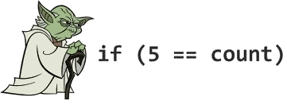
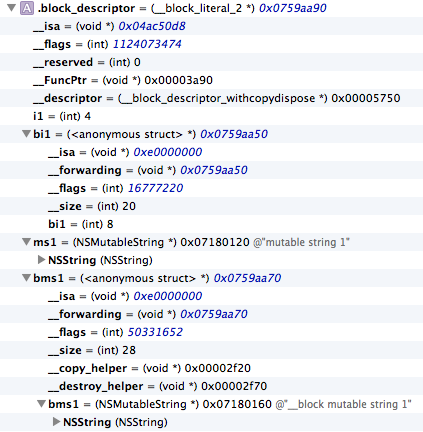

# 禅与 Objective-C 编程艺术 （Zen and the Art of the Objective-C Craftsmanship 中文翻译）

- 原文 <https://github.com/objc-zen/objc-zen-book>
- Gitbook 链接(包含 PDF, mobi, epub 格式): <http://yourtion.gitbooks.io/objc-zen-book-cn/> (感谢 [yourtion](https://github.com/yourtion) 整理 )


* [前言](#前言)
  * [Swift](#swift)
  * [贡献给社区](#贡献给社区)
  * [作者](#作者)
  * [关于中文翻译](#关于中文翻译)
* [条件语句](#条件语句)
  * [尤达表达式](#尤达表达式)
  * [nil 和 BOOL 检查](#nil-和-bool-检查)
  * [黄金大道](#黄金大道)
  * [复杂的表达式](#复杂的表达式)
  * [三元运算符](#三元运算符)
  * [错误处理](#错误处理)
* [Case语句](#case语句)
    * [枚举类型](#枚举类型)
* [命名](#命名)
  * [通用的约定](#通用的约定)
  * [常量](#常量)
  * [方法](#方法)
  * [字面值](#字面值)
* [类](#类)
  * [类名](#类名)
  * [Initializer 和 dealloc](#initializer-和-dealloc)
    * [Designated 和 Secondary 初始化方法](#designated-和-secondary初始化方法)
      * [Designated Initializer](#designated-initializer)
      * [Secondary Initializer](#secondary-initializer)
        * [参考](#参考)
    * [instancetype](#instancetype)
        * [参考](#参考)
    * [初始化模式](#初始化模式)
      * [类簇 （class cluster)](#类簇-（class-cluster）)
      * [单例](#单例)
  * [属性](#属性)
      * [Init 和 Dealloc](#init-和-dealloc)
      * [点符号](#点符号)
    * [属性定义](#属性定义)
      * [私有属性](#私有属性)
    * [可变对象](#可变对象)
    * [懒加载 (Lazy Loading)](#懒加-（lazy-loading）)
  * [方法](#方法)
    * [参数断言](#参数断言)
    * [私有方法](#私有方法)
  * [相等性](#相等性)
* [Categories](#categories)
* [Protocols](#protocols)
* [NSNotification](#nsnotification)
* [美化代码](#美化代码)
    * [空格](#空格)
    * [换行](#换行)
    * [括号](#括号)
* [代码组织](#代码组织)
  * [利用代码块](#利用代码块)
  * [Pragma](#pragma)
    * [Pragma Mark](#pragma-mark)
    * [忽略没用使用变量的编译警告](#忽略没用使用变量的编译警告)
  * [明确编译器警告和错误](#明确编译器警告和错误)
  * [字符串文档](#字符串文档)
  * [注释](#注释)
    * [头文档](#头文档)
* [对象间的通讯](#对象间的通讯)
  * [Block](#blocks)
    * [深入 Block](#深入-block)
    * [self 的循环引用](#self-的循环引用)
  * [委托和数据源](#委托和数据源)
    * [继承](#继承)
    * [多重委托](#多重委托)
* [面向切面编程](#面向切面编程)
* [参考资料](#参考资料)
    * [其他的 Objective-C 风格指南](#其他的-objective-c-风格指南)

# 前言

我们在 2013 年 11 月份开始写这本书，最初的目标是提供一份如何编写干净漂亮的 Objective-C 代码的指南：现在虽然有很多指南，但是它们都是有一些问题的。我们不想介绍一些死板的规定，我们想提供一个在开发者们之间写更一致的代码的途径。随时间的推移，这本书开始转向介绍如何设计和构建优秀的代码。

这本书的观点是代码不仅是可以编译的，同时应该是 “有效” 的。好的代码有一些特性：简明，自我解释，优秀的组织，良好的文档，良好的命名，优秀的设计以及可以被久经考验。

本书的一个理念是是代码的清晰性优先于性能，同时阐述为什么应该这么做。

虽然所有的代码都是 Objective-C 写的，但是一些主题是通用的，并且独立于编程语言。

## Swift

在 2014 年 6 月 6 日，苹果发布了面向 iOS 和 Mac 开发的新语言： Swift。
这个新语言与 Objective-C 截然不同。所以，我们改变了写这本书的计划。我们决定发布这本书当前的状态，而不是继续书写我们原来计划写下去的主题。

Objective-C 没有消失，但是现在用一个慢慢失去关注的语言来继续写这本书并不是一个明智的选择。

## 贡献给社区

我们将这本书免费发布并且贡献给社区，因为我们希望提供给读者一些有价值的内容。如果你能学到至少一条最佳实践，我们的目的就达到了。

我们已经非常用心地打磨了这些文字，但是仍然可能有一些拼写或者其他错误。我们非常希望读者给我们一个反馈或者建议，以来改善本书。所以如果有什么问题的话，请联系我们。我们非常欢迎各种 pull-request。

##  作者

**Luca Bernardi**

- http://lucabernardi.com
- @luka_bernardi
- http://github.com/lukabernardi

**Alberto De Bortoli**

- http://albertodebortoli.com
- @albertodebo
- http://github.com/albertodebortoli

## 关于中文翻译

译者

**林翔宇**
- http://linxiangyu.org
- linxiangyu@nupter.org
- http://github.com/oa414

**庞博**
- bopang@sohu-inc.com
- https://github.com/heistings

**Kevin.Xiao**
- kevinxiao1919@gmail.com
- https://github.com/KevinHM

翻译已得到原作者许可，并且会在更加完善后申请合并到原文仓库。


**部分译文表达可能存在不妥之处，非常欢迎各种修订建议和校对。 请直接 fork 本仓库，在 README.md 文件中修改，并申请 pull request 到 <https://github.com/oa414/objc-zen-book-cn/>。**


#  条件语句

条件语句体应该总是被大括号包围。尽管有时候你可以不使用大括号（比如，条件语句体只有一行内容），但是这样做会带来问题隐患。比如，增加一行代码时，你可能会误以为它是 if 语句体里面的。此外，更危险的是，如果把 if 后面的那行代码注释掉，之后的一行代码会成为 if 语句里的代码。


**推荐:**

```objective-c
if (!error) {
    return success;
}
```

**不推荐:**

```objective-c
if (!error)
    return success;
```

和

```objective-c
if (!error) return success;
```


在 2014年2月 苹果的 SSL/TLS 实现里面发现了知名的 [goto fail](https://gotofail.com/) 错误。

代码在这里：


```objective-c
static OSStatus
SSLVerifySignedServerKeyExchange(SSLContext *ctx, bool isRsa, SSLBuffer signedParams,
                                 uint8_t *signature, UInt16 signatureLen)
{
  OSStatus        err;
  ...

  if ((err = SSLHashSHA1.update(&hashCtx, &serverRandom)) != 0)
    goto fail;
  if ((err = SSLHashSHA1.update(&hashCtx, &signedParams)) != 0)
    goto fail;
    goto fail;
  if ((err = SSLHashSHA1.final(&hashCtx, &hashOut)) != 0)
    goto fail;
  ...

fail:
  SSLFreeBuffer(&signedHashes);
  SSLFreeBuffer(&hashCtx);
  return err;
}
```


显而易见，这里有没有括号包围的2行连续的 `goto fail;` 。我们当然不希望写出上面的代码导致错误。

此外，在其他条件语句里面也应该按照这种风格统一，这样更便于检查。

## 尤达表达式


不要使用尤达表达式。尤达表达式是指，拿一个常量去和变量比较而不是拿变量去和常量比较。它就像是在表达 “蓝色是不是天空的颜色” 或者 “高个是不是这个男人的属性” 而不是  “天空是不是蓝的” 或者 “这个男人是不是高个子的” 



（译者注：名字起源于星球大战中尤达大师的讲话方式，总是用倒装的语序）

**推荐:**
```objective-c
if ([myValue isEqual:@42]) { ...
```

**不推荐:**
```objective-c
if ([@42 isEqual:myValue]) { ...
```

## nil 和 BOOL 检查


类似于 Yoda 表达式，nil 检查的方式也是存在争议的。一些 notous 库像这样检查对象是否为 nil：

```objective-c
if (nil == myValue) { ...
```

或许有人会提出这是错的，因为在 nil 作为一个常量的情况下，这样做就像 Yoda 表达式了。 但是一些程序员这么做的原因是为了避免调试的困难，看下面的代码：

```objective-c
if (myValue == nil) { ...
```

如果程序员敲错成这样：

```objective-c
if (myValue = nil) { ...
```


这是合法的语句，但是即使你是一个丰富经验的程序员，即使盯着眼睛瞧上好多遍也很难调试出错误。但是如果把 nil 放在左边，因为它不能被赋值，所以就不会发生这样的错误。 如果程序员这样做，他/她就可以轻松检查出可能的原因，比一遍遍检查敲下的代码要好很多。

为了避免这些奇怪的问题，可以用感叹号来作为运算符。因为 nil 是 解释到 NO，所以没必要在条件语句里面把它和其他值比较。同时，不要直接把它和 `YES` 比较，因为 `YES` 的定义是 1， 而 `BOOL` 是 8 bit的，实际上是 char 类型。

**推荐:**
```objective-c
if (someObject) { ...
if (![someObject boolValue]) { ...
if (!someObject) { ...
```

**不推荐:**
```objective-c
if (someObject == YES) { ... // Wrong
if (myRawValue == YES) { ... // Never do this.
if ([someObject boolValue] == NO) { ...
```
同时这样也能提高一致性，以及提升可读性。

## 黄金大道

在使用条件语句编程时，代码的左边距应该是一条“黄金”或者“快乐”的大道。 也就是说，不要嵌套 `if` 语句。使用多个 return 可以避免增加循环的复杂度，并提高代码的可读性。因为方法的重要部分没有嵌套在分支里面，并且你可以很清楚地找到相关的代码。

**推荐:**

```objective-c
- (void)someMethod {
  if (![someOther boolValue]) {
      return;
  }

  //Do something important
}
```

**不推荐:**

```objective-c
- (void)someMethod {
  if ([someOther boolValue]) {
    //Do something important
  }
}
```
## 复杂的表达式 

当你有一个复杂的 if 子句的时候，你应该把它们提取出来赋给一个 BOOL 变量，这样可以让逻辑更清楚，而且让每个子句的意义体现出来。


```objective-c
BOOL nameContainsSwift  = [sessionName containsString:@"Swift"];
BOOL isCurrentYear      = [sessionDateCompontents year] == 2014;
BOOL isSwiftSession     = nameContainsSwift && isCurrentYear;

if (isSwiftSession) {
    // Do something very cool
}
```

## 三元运算符


三元运算符 ? 应该只用在它能让代码更加清楚的地方。 一个条件语句的所有的变量应该是已经被求值了的。类似 if 语句，计算多个条件子句通常会让语句更加难以理解。或者可以把它们重构到实例变量里面。


**推荐:**
```objective-c
result = a > b ? x : y;
```

**不推荐:**
```objective-c
result = a > b ? x = c > d ? c : d : y;
```

当三元运算符的第二个参数（if 分支）返回和条件语句中已经检查的对象一样的对象的时候，下面的表达方式更灵巧：

**推荐:**
```objective-c
result = object ? : [self createObject];
```

**不推荐:**
```objective-c
result = object ? object : [self createObject];
```

## 错误处理

有些方法通过参数返回 error 的引用，使用这样的方法时应当检查方法的返回值，而非 error 的引用。

**推荐:**
```objective-c
NSError *error = nil;
if (![self trySomethingWithError:&error]) {
    // Handle Error
}
```

此外，一些苹果的 API 在成功的情况下会对 error 参数（如果它非 NULL）写入垃圾值（garbage values），所以如果检查 error 的值可能导致错误 （甚至崩溃）。


# Case语句

除非编译器强制要求，括号在 case 语句里面是不必要的。但是当一个 case 包含了多行语句的时候，需要加上括号。


```objective-c
switch (condition) {
    case 1:
        // ...
        break;
    case 2: {
        // ...
        // Multi-line example using braces
        break;
       }
    case 3:
        // ...
        break;
    default: 
        // ...
        break;
}
```


有时候可以使用 fall-through 在不同的 case 里面执行同一段代码。一个 fall-through  是指移除 case 语句的 “break” 然后让下面的 case 继续执行。

```objective-c
switch (condition) {
    case 1:
    case 2:
        // code executed for values 1 and 2
        break;
    default: 
        // ...
        break;
}
```


当在 switch 语句里面使用一个可枚举的变量的时候，`default` 是不必要的。比如：

```objective-c
switch (menuType) {
    case ZOCEnumNone:
        // ...
        break;
    case ZOCEnumValue1:
        // ...
        break;
    case ZOCEnumValue2:
        // ...
        break;
}
```


此外，为了避免使用默认的 case，如果新的值加入到 enum，程序员会马上收到一个 warning 通知

`Enumeration value 'ZOCEnumValue3' not handled in switch.（枚举类型 'ZOCEnumValue3' 没有被 switch 处理）`

### 枚举类型


当使用 `enum` 的时候，建议使用新的固定的基础类型定义，因为它有更强大的类型检查和代码补全。 SDK 现在有一个 宏来鼓励和促进使用固定类型定义 - `NS_ENUM()`

**例子:**

```objective-c
typedef NS_ENUM(NSUInteger, ZOCMachineState) {
    ZOCMachineStateNone,
    ZOCMachineStateIdle,
    ZOCMachineStateRunning,
    ZOCMachineStatePaused
};
```

#  命名

##  通用的约定


尽可能遵守 Apple 的命名约定，尤其是和 [内存管理规则](https://developer.apple.com/library/mac/#documentation/Cocoa/Conceptual/MemoryMgmt/Articles/MemoryMgmt.html) ([NARC](http://stackoverflow.com/a/2865194/340508)) 相关的地方。

推荐使用长的、描述性的方法和变量名。

**推荐:**
```objective-c
UIButton *settingsButton;
```

**不推荐:**
```objective-c
UIButton *setBut;
```

##  常量

常量应该以驼峰法命名，并以相关类名作为前缀。

**推荐:**
```objective-c
static const NSTimeInterval ZOCSignInViewControllerFadeOutAnimationDuration = 0.4;
```

**不推荐:**
```objective-c
static const NSTimeInterval fadeOutTime = 0.4;
```

推荐使用常量来代替字符串字面值和数字，这样能够方便复用，而且可以快速修改而不需要查找和替换。常量应该用 `static` 声明为静态常量，而不要用 `#define`，除非它明确的作为一个宏来使用。

**推荐:**

```objective-c
static NSString * const ZOCCacheControllerDidClearCacheNotification = @"ZOCCacheControllerDidClearCacheNotification";
static const CGFloat ZOCImageThumbnailHeight = 50.0f;
```

**不推荐:**

```objective-c
#define CompanyName @"Apple Inc."
#define magicNumber 42
```

常量应该在头文件中以这样的形式暴露给外部：

```objective-c
extern NSString *const ZOCCacheControllerDidClearCacheNotification;
```
并在实现文件中为它赋值。

只有公有的常量才需要添加命名空间作为前缀。尽管实现文件中私有常量的命名可以遵循另外一种模式，你仍旧可以遵循这个规则。


##  方法

方法名与方法类型 (`-`/`+` 符号)之间应该以空格间隔。方法段之间也应该以空格间隔（以符合 Apple 风格）。参数前应该总是有一个描述性的关键词。

尽可能少用 "and" 这个词。它不应该用来阐明有多个参数，比如下面的 `initWithWidth:height:` 这个例子：

**推荐:**
```objective-c
- (void)setExampleText:(NSString *)text image:(UIImage *)image;
- (void)sendAction:(SEL)aSelector to:(id)anObject forAllCells:(BOOL)flag;
- (id)viewWithTag:(NSInteger)tag;
- (instancetype)initWithWidth:(CGFloat)width height:(CGFloat)height;
```

**不推荐:**

```objective-c
- (void)setT:(NSString *)text i:(UIImage *)image;
- (void)sendAction:(SEL)aSelector :(id)anObject :(BOOL)flag;
- (id)taggedView:(NSInteger)tag;
- (instancetype)initWithWidth:(CGFloat)width andHeight:(CGFloat)height;
- (instancetype)initWith:(int)width and:(int)height;  // Never do this.
```

##  字面值

使用字面值来创建不可变的 `NSString`, `NSDictionary`, `NSArray`, 和 `NSNumber` 对象。注意不要将 `nil` 传进 `NSArray` 和 `NSDictionary` 里，因为这样会导致崩溃。

**例子：**

```objective-c
NSArray *names = @[@"Brian", @"Matt", @"Chris", @"Alex", @"Steve", @"Paul"];
NSDictionary *productManagers = @{@"iPhone" : @"Kate", @"iPad" : @"Kamal", @"Mobile Web" : @"Bill"};
NSNumber *shouldUseLiterals = @YES;
NSNumber *buildingZIPCode = @10018;
```

**不要这样:**

```objective-c
NSArray *names = [NSArray arrayWithObjects:@"Brian", @"Matt", @"Chris", @"Alex", @"Steve", @"Paul", nil];
NSDictionary *productManagers = [NSDictionary dictionaryWithObjectsAndKeys: @"Kate", @"iPhone", @"Kamal", @"iPad", @"Bill", @"Mobile Web", nil];
NSNumber *shouldUseLiterals = [NSNumber numberWithBool:YES];
NSNumber *buildingZIPCode = [NSNumber numberWithInteger:10018];
```

如果要用到这些类的可变副本，我们推荐使用 `NSMutableArray`, `NSMutableString` 这样的类。

**应该避免**下面这样:

```objective-c
NSMutableArray *aMutableArray = [@[] mutableCopy];
```

上面这种书写方式的效率和可读性的都存在问题。

效率方面，一个不必要的不可变对象被创建后立马被废弃了；虽然这并不会让你的 App 变慢（除非这个方法被频繁调用），但是确实没必要为了少打几个字而这样做。

可读性方面，存在两个问题：第一个问题是当你浏览代码并看见 `@[]` 的时候，你首先联想到的是 `NSArray` 实例，但是在这种情形下你需要停下来深思熟虑的检查；另一个问题是，一些新手以他的水平看到你的代码后可能会对这是一个可变对象还是一个不可变对象产生分歧。他/她可能不熟悉可变拷贝构造的含义（这并不是说这个知识不重要）。当然，不存在绝对的错误，我们只是讨论代码的可用性（包括可读性)。

#  类 

##  类名

类名应该以**三**个大写字母作为前缀（双字母前缀为 Apple 的类预留）。尽管这个规范看起来有些古怪，但是这样做可以减少 Objective-C 没有命名空间所带来的问题。

一些开发者在定义模型对象时并不遵循这个规范（对于 Core Data 对象，我们更应该遵循这个规范）。我们建议在定义 Core Data 对象时严格遵循这个约定，因为最终你可能需要把你的 Managed Object Model（托管对象模型）与其他（第三方库）的 MOMs（Managed Object Model）合并。

你可能注意到了，这本书里类的前缀（不仅仅是类，也包括公开的常量、Protocol 等的前缀）是`ZOC`。

另一个好的类的命名规范：当你创建一个子类的时候，你应该把说明性的部分放在前缀和父类名的在中间。

举个例子：如果你有一个 `ZOCNetworkClient` 类，子类的名字会是`ZOCTwitterNetworkClient` (注意 "Twitter" 在 "ZOC" 和 "NetworkClient" 之间); 按照这个约定， 一个`UIViewController` 的子类会是 `ZOCTimelineViewController`.


## Initializer 和 dealloc 

推荐的代码组织方式是将 `dealloc` 方法放在实现文件的最前面（直接在  `@synthesize` 以及 `@dynamic` 之后），`init` 应该跟在 `dealloc` 方法后面。

如果有多个初始化方法， 指定初始化方法 (designated initializer) 应该放在最前面，间接初始化方法 (secondary initializer) 跟在后面，这样更有逻辑性。如今有了 ARC，dealloc 方法几乎不需要实现，不过把 init 和 dealloc 放在一起可以从视觉上强调它们是一对的。通常，在 init 方法中做的事情需要在 dealloc 方法中撤销。

`init` 方法应该是这样的结构：

```objective-c
- (instancetype)init
{
    self = [super init]; // call the designated initializer
    if (self) {
        // Custom initialization
    }
    return self;
}
```


为什么设置 `self` 为 `[super init]` 的返回值，以及中间发生了什么呢？这是一个十分有趣的话题。

我们退一步讲：我们常常写 `[[NSObject alloc] init]` 这样的代码，从而淡化了 `alloc` 和 `init` 的区别。Objective-C 的这个特性叫做 *两步创建* 。 

这意味着申请分配内存和初始化被分离成两步，`alloc` 和 `init`。
- `alloc` 负责创建对象，这个过程包括分配足够的内存来保存对象，写入 `isa` 指针，初始化引用计数，以及重置所有实例变量。
- `init` 负责初始化对象，这意味着使对象处于可用状态。这通常意味着为对象的实例变量赋予合理有用的值。

`alloc` 方法将返回一个有效的未初始化的对象实例。每一个对这个实例发送的消息会被转换成一次 `objc_msgSend()` 函数的调用，形参 `self` 的实参是 `alloc` 返回的指针；这样 `self` 在所有方法的作用域内都能够被访问。

按照惯例，为了完成两步创建，新创建的实例第一个被调用的方法将是 `init` 方法。注意，`NSObject` 在实现 `init` 时，只是简单的返回了 `self`。

关于 `init` 的约定还有一个重要部分：这个方法可以（并且应该）通过返回 `nil` 来告诉调用者，初始化失败了；初始化可能会因为各种原因失败，比如一个输入的格式错误了，或者另一个需要的对象初始化失败了。
这样我们就能理解为什么总是需要调用 `self = [super init]`。如果你的父类说初始化自己的时候失败了，那么你必须假定你正处于一个不稳定的状态，因此在你的实现里不要继续你自己的初始化并且也返回 `nil`。如果不这样做，你可能会操作一个不可用的对象，它的行为是不可预测的，最终可能会导致你的程序崩溃。

`init` 方法在被调用的时候可以通过重新给 `self` 重新赋值来返回另一个实例，而非调用的那个实例。例如[类簇](#类簇)，还有一些 Cocoa 类为相等的（不可变的）对象返回同一个实例。

### Designated 和 Secondary 初始化方法

Objective-C 有指定初始化方法(designated initializer)和间接(secondary initializer)初始化方法的观念。
designated 初始化方法是提供所有的参数，secondary 初始化方法是一个或多个，并且提供一个或者更多的默认参数来调用 designated 初始化的初始化方法。

```objective-c
@implementation ZOCEvent

- (instancetype)initWithTitle:(NSString *)title
                         date:(NSDate *)date
                     location:(CLLocation *)location
{
    self = [super init];
    if (self) {
        _title    = title;
        _date     = date;
        _location = location;
    }
    return self;
}

- (instancetype)initWithTitle:(NSString *)title
                         date:(NSDate *)date
{
    return [self initWithTitle:title date:date location:nil];
}

- (instancetype)initWithTitle:(NSString *)title
{
    return [self initWithTitle:title date:[NSDate date] location:nil];
}

@end
```


`initWithTitle:date:location:` 就是 designated 初始化方法，另外的两个是 secondary 初始化方法。因为它们仅仅是调用类实现的 designated 初始化方法

#### Designated Initializer 


一个类应该有且只有一个 designated 初始化方法，其他的初始化方法应该调用这个 designated 的初始化方法（虽然这个情况有一个例外）

这个分歧没有要求那个初始化函数需要被调用。


在类继承中调用任何 designated 初始化方法都是合法的，而且应该保证 *所有的* designated initializer 在类继承中是从祖先（通常是  `NSObject`）到你的类向下调用的。

实际上这意味着第一个执行的初始化代码是最远的祖先，然后从顶向下的类继承，所有类都有机会执行他们特定初始化代码。这样，你在做特定初始化工作前，所有从超类继承的东西都是不可用的状态。 虽然这没有明确的规定，但是所有 Apple 的框架都保证遵守这个约定，你的类也应该这样做。


当定义一个新类的时候有三个不同的方式：

1. 不需要重载任何初始化函数
2. 重载 designated initializer
3. 定义一个新的 designated initializer


第一个方案是最简单的：你不需要增加类的任何初始化逻辑，只需要依照父类的designated initializer。

当你希望提供额外的初始化逻辑的时候，你可以重载 designated initializer。你只需要重载直接超类的 designated initializer 并且确认你的实现调用了超类的方法。

一个典型的例子是你创造`UIViewController`子类的时候重载`initWithNibName:bundle:`方法。

```objective-c
@implementation ZOCViewController

- (id)initWithNibName:(NSString *)nibNameOrNil bundle:(NSBundle *)nibBundleOrNil
{
    // call to the superclass designated initializer
    self = [super initWithNibName:nibNameOrNil bundle:nibBundleOrNil];
    if (self) {
        // Custom initialization （自定义的初始化过程）
    }
    return self;
}

@end
```

在 `UIViewController`  子类的例子里面如果重载  `init` 会是一个错误，这个情况下调用者会尝试调用 `initWithNib:bundle` 初始化你的类，你的类实现不会被调用。这同样违背了它应该是合法调用任何 designated initializer 的规则。


在你希望提供你自己的初始化函数的时候，你应该遵守这三个步骤来保证获得正确的行为：


1. 定义你的 designated initializer，确保调用了直接超类的 designated initializer。
2. 重载直接超类的 designated initializer。调用你的新的  designated initializer。
3. 为新的 designated initializer 写文档。


很多开发者忽略了后两步，这不仅仅是一个粗心的问题，而且这样违反了框架的规则，可能导致不确定的行为和bug。
让我们看看正确的实现的例子：

```objective-c
@implementation ZOCNewsViewController

- (id)initWithNews:(ZOCNews *)news
{
    // call to the immediate superclass's designated initializer （调用直接超类的 designated initializer）
    self = [super initWithNibName:nil bundle:nil];
    if (self) {
        _news = news;
    }
    return self;
}

// Override the immediate superclass's designated initializer （重载直接父类的  designated initializer）
- (id)initWithNibName:(NSString *)nibNameOrNil bundle:(NSBundle *)nibBundleOrNil
{
    // call the new designated initializer
    return [self initWithNews:nil];
}

@end
```


如果你没重载 `initWithNibName:bundle:` ，而且调用者决定用这个方法初始化你的类(这是完全合法的)。 `initWithNews:` 永远不会被调用，所以导致了不正确的初始化流程，你的类的特定初始化逻辑没有被执行。


即使可以推断那个方法是 designated initializer，也最好清晰地明确它（未来的你或者其他开发者在改代码的时候会感谢你的）。

你应该考虑来用这两个策略（不是互斥的）：第一个是你在文档中明确哪一个初始化方法是 designated 的，你可以用编译器的指令 `__attribute__((objc_designated_initializer))`  来标记你的意图。

用这个编译指令的时候，编译器会来帮你。如果你的新的 designated initializer 没有调用超类的 designated initializer，那么编译器会发出警告。

然而，当没有调用类的  designated initializer 的时候（并且依次提供必要的参数），并且调用其他父类中的 designated initialize 的时候，会变成一个不可用的状态。参考之前的例子，当实例化一个 `ZOCNewsViewController`  展示一个新闻而那条新闻没有展示的话，就会毫无意义。这个情况下你应该只需要让其他的 designated initializer 失效，来强制调用一个非常特别的 designated initializer。通过使用另外一个编译器指令  `__attribute__((unavailable("Invoke the designated initializer"))) ` 来修饰一个方法，通过这个属性，会让你在试图调用这个方法的时候产生一个编译错误。

这是之前的例子相关的实现的头文件(这里使用宏来让代码没有那么啰嗦)

```objective-c

@interface ZOCNewsViewController : UIViewController

- (instancetype)initWithNews:(ZOCNews *)news ZOC_DESIGNATED_INITIALIZER;
- (instancetype)initWithNibName:(NSString *)nibNameOrNil bundle:(NSBundle *)nibBundleOrNil ZOC_UNAVAILABLE_INSTEAD(initWithNews:);
- (instancetype)init ZOC_UNAVAILABLE_INSTEAD(initWithNews:);

@end

```


上述的一个推论是：你应该永远不从 designated initializer 里面调用一个 secondary initializer （如果secondary initializer 遵守约定，它会调用 designated initializer）。如果这样，调用很可能会调用一个子类重写的 init 方法并且陷入无限递归之中。


不过一个例外是一个对象是否遵守 `NSCoding` 协议，并且它通过方法 `initWithCoder:` 初始化。
我们应该看超类是否符合 `NSCoding` 协议来区别对待。
符合的时候，如果你只是调用 `[super initWithCoder:]` ，你可能需要在 designated initializer 里面写一些通用的初始化代码，处理这种情况的一个好方法是把这些代码放在私有方法里面(比如  `p_commonInit` )。
当你的超类不符合 `NSCoding` 协议的时候，推荐把 `initWithCoder:` 作为 secondary initializer 来对待，并且调用 `self` 的 designated initializer。 注意这违反了 Apple 写在 [Archives and Serializations Programming Guide](https://developer.apple.com/library/mac/documentation/cocoa/Conceptual/Archiving/Articles/codingobjects.html#//apple_ref/doc/uid/20000948-BCIHBJDE)  上面的规定：


> the object should first invoke its superclass's designated initializer to initialize inherited state（对象总是应该首先调用超类的 designated initializer 来初始化继承的状态）


如果你的类不是  `NSObject` 的直接子类，这样做的话，会导致不可预测的行为。

####  Secondary Initializer 


正如之前的描述，secondary initializer 是一种提供默认值、行为到 designated initializer的方法。也就是说，在这样的方法里面你不应该有初始化实例变量的操作，并且你应该一直假设这个方法不会得到调用。我们保证的是唯一被调用的方法是 designated initializer。
这意味着你的 secondary initializer 总是应该调用 Designated initializer  或者你自定义(上面的第三种情况：自定义Designated initializer)的 `self`的 designated initializer。有时候，因为错误，可能打成了  `super`，这样会导致不符合上面提及的初始化顺序（在这个特别的例子里面，是跳过当前类的初始化）

#####  参考

- https://developer.apple.com/library/ios/Documentation/General/Conceptual/DevPedia-CocoaCore/ObjectCreation.html
- https://developer.apple.com/library/ios/documentation/General/Conceptual/CocoaEncyclopedia/Initialization/Initialization.html
- https://developer.apple.com/library/ios/Documentation/General/Conceptual/DevPedia-CocoaCore/MultipleInitializers.html
- https://blog.twitter.com/2014/how-to-objective-c-initializer-patterns


### instancetype 


我们经常忽略 Cocoa 充满了约定，并且这些约定可以帮助编译器变得更加聪明。无论编译器是否遭遇 `alloc` 或者 `init` 方法，他会知道，即使返回类型都是 `id` ，这些方法总是返回接受到的类类型的实例。因此，它允许编译器进行类型检查。（比如，检查方法返回的类型是否合法）。Clang的这个好处来自于 [related result type](http://clang.llvm.org/docs/LanguageExtensions.html#related-result-types)， 意味着：


> messages sent to one of alloc and init methods will have the same static type as the instance of the receiver class （发送到 alloc 或者 init 方法的消息会有同样的静态类型检查是否为接受类的实例。）


更多的关于这个自动定义相关返回类型的约定请查看 Clang Language Extensions guide 的[appropriate section]((http://clang.llvm.org/docs/LanguageExtensions.html#related-result-types)) 


一个相关的返回类型可以明确地规定用 `instancetype` 关键字作为返回类型，并且它可以在一些工厂方法或者构造器方法的场景下很有用。它可以提示编译器正确地检查类型，并且更加重要的是，这同时适用于它的子类。

```objective-c
@interface ZOCPerson
+ (instancetype)personWithName:(NSString *)name;
@end
```

虽然如此，根据 clang 的定义，`id` 可以被编译器提升到 `instancetype` 。在 `alloc` 或者 `init` 中，我们强烈建议对所有返回类的实例的类方法和实例方法使用 `instancetype` 类型。


在你的 API 中要构成习惯以及保持始终如一的，此外，通过对你代码的小调整你可以提高可读性：在简单的浏览的时候你可以区分哪些方法是返回你类的实例的。你以后会感谢这些注意过的小细节的。
##### 参考
- http://tewha.net/2013/02/why-you-should-use-instancetype-instead-of-id/
- http://tewha.net/2013/01/when-is-id-promoted-to-instancetype/
- http://clang.llvm.org/docs/LanguageExtensions.html#related-result-types
- http://nshipster.com/instancetype/

-------------------

###  初始化模式

####  类簇 （class cluster)

类簇在Apple的文档中这样描述：

> an architecture that groups a number of private, concrete subclasses under a public, abstract superclass. （一个在共有的抽象超类下设置一组私有子类的架构）

如果这个描述听起来很熟悉，说明你的直觉是对的。 Class cluster 是 Apple 对[抽象工厂](http://en.wikipedia.org/wiki/Abstract_factory_pattern)设计模式的称呼。


class cluster 的想法很简单: 使用信息进行(类的)初始化处理期间，会使用一个抽象类（通常作为初始化方法的参数或者判定环境的可用性参数）来完成特定的逻辑或者实例化一个具体的子类。而这个"Public Facing（面向公众的）"类，必须非常清楚他的私有子类，以便在面对具体任务的时候有能力返回一个恰当的私有子类实例。对调用者来说只需知道对象的各种API的作用即可。这个模式隐藏了他背后复杂的初始化逻辑，调用者也不需要关心背后的实现。


Class clusters 在 Apple 的Framework 中广泛使用：一些明显的例子比如  `NSNumber` 可以返回不同类型给你的子类，取决于 数字类型如何提供  (Integer, Float, etc...) 或者 `NSArray` 返回不同的最优存储策略的子类。


这个模式的精妙的地方在于，调用者可以完全不管子类，事实上，这可以用在设计一个库，可以用来交换实际的返回的类，而不用去管相关的细节，因为它们都遵从抽象超类的方法。


我们的经验是使用类簇可以帮助移除很多条件语句。


一个经典的例子是如果你有为 iPad 和 iPhone 写的一样的 UIViewController 子类，但是在不同的设备上有不同的行为。


比较基础的实现是用条件语句检查设备，然后执行不同的逻辑。虽然刚开始可能不错，但是随着代码的增长，运行逻辑也会趋于复杂。
一个更好的实现的设计是创建一个抽象而且宽泛的 view controller 来包含所有的共享逻辑，并且对于不同设备有两个特别的子例。


通用的 view controller  会检查当前设备并且返回适当的子类。


```objective-c
@implementation ZOCKintsugiPhotoViewController

- (id)initWithPhotos:(NSArray *)photos
{
    if ([self isMemberOfClass:ZOCKintsugiPhotoViewController.class]) {
        self = nil;

        if ([UIDevice isPad]) {
            self = [[ZOCKintsugiPhotoViewController_iPad alloc] initWithPhotos:photos];
        }
        else {
            self = [[ZOCKintsugiPhotoViewController_iPhone alloc] initWithPhotos:photos];
        }
        return self;
    }
    return [super initWithNibName:nil bundle:nil];
}

@end
```


这个子例程展示了如何创建一个类簇。

   1. 使用`[self isMemberOfClass:ZOCKintsugiPhotoViewController.class]`防止子类中重载初始化方法，避免无限递归。当`[[ZOCKintsugiPhotoViewController alloc] initWithPhotos:photos]`被调用时，上面条件表达式的结果将会是True。
   
   2. `self = nil`的目的是移除`ZOCKintsugiPhotoViewController`实例上的所有引用，实例(抽象类的实例)本身将会解除分配（ 当然ARC也好MRC也好dealloc都会发生在Main Runloop这一次的结束时）。
   
   3. 接下来的逻辑就是判断哪一个私有子类将被初始化。我们假设在iPhone上运行这段代码并且`ZOCKintsugiPhotoViewController_iPhone`没有重载`initWithPhotos:`方法。这种情况下，当执行`self = [[ZOCKintsugiPhotoViewController_iPhone alloc] initWithPhotos:photos];`,`ZOCKintsugiPhotoViewController`将会被调用，第一次检查将会在这里发生，鉴于`ZOCKintsugiPhotoViewController_iPhone`不完全是`ZOCKintsugiPhotoViewController`，表达式`[self isMemberOfClass:ZOCKintsugiPhotoViewController.class]`将会是False,于是就会调用`[super initWithNibName:nil bundle:nil]`，于是就会进入`ZOCKintsugiPhotoViewController`的初始化过程，这时候因为调用者就是`ZOCKintsugiPhotoViewController`本身，这一次的检查必定为True,接下来就会进行正确的初始化过程。(NOTE：这里必须是完全遵循Designated initializer 以及Secondary initializer的设计规范的前提下才会其效果的!不明白这个规范的可以后退一步熟悉这种规范在回头来看这个说明)

> NOTE: 这里的意思是，代码是在iPhone上调试的，程序员使用了`self = [[ZOCKintsugiPhotoViewController_iPhone alloc] initWithPhotos:photos];`来初始化某个view controller的对象，当代码运行在iPad上时，这个初始化过程也是正确的，因为无论程序员的代码中使用`self = [[ZOCKintsugiPhotoViewController_iPhone alloc] initWithPhotos:photos];`来初始化viewController(iPhone上编写运行在iPad上)，还是使用`self = [[ZOCKintsugiPhotoViewController_iPad alloc] initWithPhotos:photos];`来初始化viewController(iPad上编写，运行在iPhone上)，都会因为ZOCKintsugiPhotoViewController的`initWithPhotos:`方法的存在而变得通用起来。


####   单例

如果可能，请尽量避免使用单例而是依赖注入。
然而，如果一定要用，请使用一个线程安全的模式来创建共享的实例。对于 GCD，用 `dispatch_once()` 函数就可以咯。


```objective-c
+ (instancetype)sharedInstance
{
   static id sharedInstance = nil;
   static dispatch_once_t onceToken = 0;
   dispatch_once(&onceToken, ^{
      sharedInstance = [[self alloc] init];
   });
   return sharedInstance;
}
```


使用 dispatch_once()，来控制代码同步，取代了原来的约定俗成的用法。


```objective-c
+ (instancetype)sharedInstance
{
    static id sharedInstance;
    @synchronized(self) {
        if (sharedInstance == nil) {
            sharedInstance = [[MyClass alloc] init];
        }
    }
    return sharedInstance;
}
```


 `dispatch_once()`  的优点是，它更快，而且语法上更干净，因为dispatch_once()的意思就是 “把一些东西执行一次”，就像我们做的一样。 这样同时可以避免 [possible and sometimes prolific crashes][singleton_cocoasamurai].


经典的单例对象是：一个设备的GPS以及它的加速度传感器(也称动作感应器)。
虽然单例对象可以子类化，但这种方式能够有用的情况非常少见。
必须有证据表明，给定类的接口趋向于作为单例来使用。
所以，单例通常公开一个`sharedInstance`的类方法就已经足够了，没有任何的可写属性需要被暴露出来。

尝试着把单例作为一个对象的容器，在代码或者应用层面上共享，是一个糟糕和丑陋的设计。

> NOTE：单例模式应该运用于类及类的接口趋向于作为单例来使用的情况 （译者注）

[singleton_cocoasamurai]: http://cocoasamurai.blogspot.com/2011/04/singletons-your-doing-them-wrong.html

##  属性

属性应该尽可能描述性地命名，避免缩写，并且是小写字母开头的驼峰命名。我们的工具可以很方便地帮我们自动补全所有东西（嗯。。几乎所有的，Xcode 的Derived Data 会索引这些命名）。所以没理由少打几个字符了，并且最好尽可能在你源码里表达更多东西。

**例子 :**
```objective-c
NSString *text;
```

**不要这样 :**
```objective-c
NSString* text;
NSString * text;
```


（注意：这个习惯和常量不同，这是主要从常用和可读性考虑。 C++ 的开发者偏好从变量名中分离类型，作为类型它应该是
`NSString*` （对于从堆中分配的对象，对于C++是能从栈上分配的）格式。）


使用属性的自动同步 (synthesize) 而不是手动的  `@synthesize` 语句，除非你的属性是 protocol 的一部分而不是一个完整的类。如果 Xcode 可以自动同步这些变量，就让它来做吧。否则只会让你抛开 Xcode 的优点，维护更冗长的代码。

你应该总是使用 setter 和 getter 方法访问属性，除了 `init` 和 `dealloc` 方法。通常，使用属性让你增加了在当前作用域之外的代码块的可能所以可能带来更多副作用。

你总应该用 getter 和 setter ，因为：

- 使用  setter 会遵守定义的内存管理语义(`strong`, `weak`, `copy` etc...) ，这个在 ARC 之前就是相关的内容。举个例子，`copy` 属性定义了每个时候你用 setter 并且传送数据的时候，它会复制数据而不用额外的操作。
- KVO 通知(`willChangeValueForKey`, `didChangeValueForKey`) 会被自动执行。
- 更容易debug：你可以设置一个断点在属性声明上并且断点会在每次 getter / setter 方法调用的时候执行，或者你可以在自己的自定义 setter/getter 设置断点。
- 允许在一个单独的地方为设置值添加额外的逻辑。

你应该倾向于用 getter：

- 它是对未来的变化有扩展能力的（比如，属性是自动生成的）。
- 它允许子类化。
- 更简单的debug（比如，允许拿出一个断点在 getter 方法里面，并且看谁访问了特别的 getter
- 它让意图更加清晰和明确：通过访问 ivar `_anIvar` 你可以明确的访问 `self->_anIvar`.这可能导致问题。在 block 里面访问 ivar （你捕捉并且 retain 了 self，即使你没有明确的看到 self 关键词）。
- 它自动产生KVO 通知。
- 在消息发送的时候增加的开销是微不足道的。更多关于性能问题的介绍你可以看 [Should I Use a Property or an Instance Variable?](http://blog.bignerdranch.com/4005-should-i-use-a-property-or-an-instance-variable/)。

#### Init 和 Dealloc


有一个例外：永远不要在 init 方法（以及其他初始化方法）里面用 getter 和 setter 方法，你应当直接访问实例变量。这样做是为了防止有子类时，出现这样的情况：它的子类最终重载了其 setter 或者 getter 方法，因此导致该子类去调用其他的方法、访问那些处于不稳定状态，或者称为没有初始化完成的属性或者 ivar 。记住一个对象仅仅在 init 返回的时候，才会被认为是达到了初始化完成的状态。

同样在 dealloc 方法中（在 dealloc 方法中，一个对象可以在一个 不确定的状态中）这是同样需要被注意的。

* [Advanced Memory Management Programming Guide](https://developer.apple.com/library/mac/documentation/Cocoa/Conceptual/MemoryMgmt/Articles/mmPractical.html#//apple_ref/doc/uid/TP40004447-SW6) under the self-explanatory section "Don't Use Accessor Methods in Initializer Methods and dealloc";
* [Migrating to Modern Objective-C](http://adcdownload.apple.com//wwdc_2012/wwdc_2012_session_pdfs/session_413__migrating_to_modern_objectivec.pdf) at WWDC 2012 at slide 27;
* in a [pull request](https://github.com/NYTimes/objective-c-style-guide/issues/6) form Dave DeLong's. 


此外，在 init 中使用 setter 不会很好执行  `UIAppearence`  代理（参见  [UIAppearance for Custom Views](http://petersteinberger.com/blog/2013/uiappearance-for-custom-views/) 看更多相关信息)。

#### 点符号


当使用 setter getter 方法的时候尽量使用点符号。应该总是用点符号来访问以及设置属性。

**例子:**

```Objective-C
view.backgroundColor = [UIColor orangeColor];
[UIApplication sharedApplication].delegate;

```

**不要这样:**

```Objective-C
[view setBackgroundColor:[UIColor orangeColor]];
UIApplication.sharedApplication.delegate;
```

使用点符号会让表达更加清晰并且帮助区分属性访问和方法调用

### 属性定义


推荐按照下面的格式来定义属性

```objective-c
@property (nonatomic, readwrite, copy) NSString *name;
```

属性的参数应该按照下面的顺序排列： 原子性，读写 和 内存管理。 这样做你的属性更容易修改正确，并且更好阅读。(译者注：习惯上修改某个属性的修饰符时，一般从属性名从右向左搜索需要修动的修饰符。最可能从最右边开始修改这些属性的修饰符，根据经验这些修饰符被修改的可能性从高到底应为：内存管理 > 读写权限 >原子操作)


你必须使用 `nonatomic`，除非特别需要的情况。在iOS中，`atomic`带来的锁特别影响性能。

属性可以存储一个代码块。为了让它存活到定义的块的结束，必须使用 `copy` （block 最早在栈里面创建，使用 `copy`让 block 拷贝到堆里面去）


为了完成一个共有的 getter 和一个私有的 setter，你应该声明公开的属性为 `readonly`  并且在类扩展总重新定义通用的属性为 `readwrite` 的。

```objective-c
//.h文件中
@interface MyClass : NSObject
@property (nonatomic, readonly, strong) NSObject *object;
@end
//.m文件中
@interface MyClass ()
@property (nonatomic, readwrite, strong) NSObject *object;
@end

@implementation MyClass
//Do Something cool
@end

```

描述`BOOL`属性的词如果是形容词，那么setter不应该带`is`前缀，但它对应的 getter 访问器应该带上这个前缀，如：

```objective-c
@property (assign, getter=isEditable) BOOL editable;
```

文字和例子引用自 [Cocoa Naming Guidelines](https://developer.apple.com/library/mac/#documentation/Cocoa/Conceptual/CodingGuidelines/Articles/NamingIvarsAndTypes.html#//apple_ref/doc/uid/20001284-BAJGIIJE)。

在实现文件中应避免使用`@synthesize`,因为Xcode已经自动为你添加了。

#### 私有属性


私有属性应该定义在类的实现文件的类的扩展 (匿名的 category) 中。不允许在有名字的 category(如 `ZOCPrivate`）中定义私有属性，除非你扩展其他类。

**例子:**

```objective-c
@interface ZOCViewController ()
@property (nonatomic, strong) UIView *bannerView;
@end
```

### 可变对象


任何可以用一个可变的对象设置的（(比如 `NSString`,`NSArray`,`NSURLRequest`)）属性的内存管理类型必须是 `copy` 的。

这是为了确保防止在不明确的情况下修改被封装好的对象的值(译者注：比如执行 array(定义为 copy 的 NSArray 实例) = mutableArray，copy 属性会让 array 的 setter 方法为 array = [mutableArray copy], [mutableArray copy] 返回的是不可变的 NSArray 实例，就保证了正确性。用其他属性修饰符修饰，容易在直接赋值的时候，array 指向的是 NSMuatbleArray 的实例，在之后可以随意改变它的值，就容易出错)。

你应该同时避免暴露在公开的接口中可变的对象，因为这允许你的类的使用者改变类自己的内部表示并且破坏类的封装。你可以提供可以只读的属性来返回你对象的不可变的副本。

```objective-c
/* .h */
@property (nonatomic, readonly) NSArray *elements

/* .m */
- (NSArray *)elements {
  return [self.mutableElements copy];
}
```

### 懒加载（Lazy Loading）

当实例化一个对象需要耗费很多资源，或者配置一次就要调用很多配置相关的方法而你又不想弄乱这些方法时，我们需要重写 getter 方法以延迟实例化，而不是在 init 方法里给对象分配内存。通常这种操作使用下面这样的模板：


```objective-c

- (NSDateFormatter *)dateFormatter {
  if (!_dateFormatter) {
    _dateFormatter = [[NSDateFormatter alloc] init];
        NSLocale *enUSPOSIXLocale = [[NSLocale alloc] initWithLocaleIdentifier:@"en_US_POSIX"];
        [_dateFormatter setLocale:enUSPOSIXLocale];
        [_dateFormatter setDateFormat:@"yyyy-MM-dd'T'HH:mm:ss.SSS"];//毫秒是SSS，而非SSSSS
  }
  return _dateFormatter;
}

```

即使这样做在某些情况下很不错，但是在实际这样做之前应当深思熟虑。事实上，这样的做法是可以避免的。下面是使用延迟实例化的争议。


* getter 方法应该避免副作用。看到 getter 方法的时候，你不会想到会因此创建一个对象或导致副作用，实际上如果调用 getter 方法而不使用其返回值编译器会报警告 “Getter 不应该仅因它产生的副作用而被调用”。

> 副作用指当调用函数时，除了返回函数值之外，还对主调用函数产生附加的影响。例如修改全局变量（函数外的变量）或修改参数。函数副作用会给程序设计带来不必要的麻烦，给程序带来十分难以查找的错误，并且降低程序的可读性。（译者注）

* 你在第一次访问的时候改变了初始化的消耗，产生了副作用，这会让优化性能变得困难（以及测试）
* 这个初始化可能是不确定的：比如你期望属性第一次被一个方法访问，但是你改变了类的实现，访问器在你预期之前就得到了调用，这样可以导致问题，特别是初始化逻辑可能依赖于类的其他不同状态的时候。总的来说最好明确依赖关系。
* 这个行为不是 KVO 友好的。如果 getter 改变了引用，他应该通过一个  KVO 通知来通知改变。当访问 getter 的时候收到一个改变的通知很奇怪。


##  方法

### 参数断言


你的方法可能要求一些参数来满足特定的条件（比如不能为nil），在这种情况下最好使用 `NSParameterAssert()` 来断言条件是否成立或是抛出一个异常。

###  私有方法


永远不要在你的私有方法前加上 `_` 前缀。这个前缀是 Apple 保留的。不要冒重载苹果的私有方法的险。

##  相等性

当你要实现相等性的时候记住这个约定：你需要同时实现`isEqual` 和 `hash`方法。如果两个对象是被`isEqual`认为相等的，它们的 `hash` 方法需要返回一样的值。但是如果  `hash` 返回一样的值，并不能确保他们相等。

这个约定当对象被存储在集合中（如 `NSDictionary` 和 `NSSet` 在底层使用 hash 表数据的数据结构）的时候，用来查找这些对象的。

```objective-c
@implementation ZOCPerson

- (BOOL)isEqual:(id)object {
    if (self == object) {
        return YES;
    }

    if (![object isKindOfClass:[ZOCPerson class]]) {
        return NO;
    }

    // check objects properties (name and birthday) for equality （检查对象属性（名字和生日）的相等性
    ...
    return propertiesMatch;
}

- (NSUInteger)hash {
    return [self.name hash] ^ [self.birthday hash];
}

@end
```


一定要注意 hash 方法不能返回一个常量。这是一个典型的错误并且会导致严重的问题，因为实际上`hash`方法的返回值会作为对象在 hash 散列表中的 key,这会导致 hash 表 100% 的碰撞。


你总是应该用 `isEqualTo<#class-name-without-prefix#>:` 这样的格式实现一个相等性检查方法。如果你这样做，会优先调用这个方法来避免上面的类型检查。

一个完整的 isEqual 方法应该是这样的：


```objective-c


- (BOOL)isEqual:(id)object {
    if (self == object) {
      return YES;
    }

    if (![object isKindOfClass:[ZOCPerson class]]) {
      return NO;
    }

    return [self isEqualToPerson:(ZOCPerson *)object];
}

- (BOOL)isEqualToPerson:(Person *)person {
    if (!person) {
        return NO;
    }

    BOOL namesMatch = (!self.name && !person.name) ||
                       [self.name isEqualToString:person.name];
    BOOL birthdaysMatch = (!self.birthday && !person.birthday) ||
                           [self.birthday isEqualToDate:person.birthday];

  return haveEqualNames && haveEqualBirthdays;
}
```
> 译者注：
> 一般而言我们会直接调用自定义的`isEqualTo__ClassName__:`方法，对类的实例判等。
> 
> 像相等性的开篇已经提到的那样，这里应该复写`isEqual:`方法，因为NSObject的`isEqual:`方法显然不会考虑我们自定义类的类型判断及属性的相等性。当我们自定义的类的对象处在无序集合中被查找时，会自动调用`isEqual:`。同样的该类的`hash`方法，也会在集合查找对象的时候被使用，我们也可以通过复写`hash`方法以达到用自己的标准来判定对象是否`hash`等同。
> 
> 我们实现的`hash`方法应该建立在系统提供的各种对象的`hash`方法之上（像开篇的例程那样）。不推荐自己去实现某种`hash`算法来替代系统提供的`hash`算法，这一般而言会大大影响性能或者准确性，系统提供的`hash`算法已经经过无数次修缮，足以满足你的要求。

一个对象实例的 `hash` 计算结果应该是确定的。当它被加入到一个容器对象（比如 `NSArray`, `NSSet`, 或者 `NSDictionary`）的时候这是很重要的，否则行为会无法预测（所有的容器对象使用对象的 hash 来查找或者实施特别的行为，如确定唯一性）这也就是说，应该用不可变的属性来计算 hash 值，或者，最好保证对象是不可变的。

# Categories


虽然我们知道这样写很丑, 但是我们应该要在我们的 category 方法前加上自己的小写前缀以及下划线，比如`- (id)zoc_myCategoryMethod`。 这种实践同样[被苹果推荐](https://developer.apple.com/library/ios/documentation/cocoa/conceptual/ProgrammingWithObjectiveC/CustomizingExistingClasses/CustomizingExistingClasses.html#//apple_ref/doc/uid/TP40011210-CH6-SW4)。

这是非常必要的。因为如果在扩展的 category 或者其他 category 里面已经使用了同样的方法名，会导致不可预计的后果。实际上，实际被调用的是最后被加载的那个 category 中方法的实现(译者注：如果导入的多个 category 中有一些同名的方法导入到类里时，最终调用哪个是由编译时的加载顺序来决定的，最后一个加载进来的方法会覆盖之前的方法)。


如果想要确认你的分类方法没有覆盖其他实现的话，可以把环境变量 OBJC_PRINT_REPLACED_METHODS 设置为 YES，这样那些被取代的方法名字会打印到 Console 中。现在 LLVM 5.1  不会为此发出任何警告和错误提示，所以自己小心不要在分类中重载方法。

一个好的实践是在 category 名中使用前缀。

** 例子 **

```objective-c
@interface NSDate (ZOCTimeExtensions)
- (NSString *)zoc_timeAgoShort;
@end
```

** 不要这样 **

```objective-c
@interface NSDate (ZOCTimeExtensions)
- (NSString *)timeAgoShort;
@end
```


分类可以用来在头文件中定义一组功能相似的方法。这是在 Apple的 Framework 也很常见的一个实践（下面例子的取自`NSDate` 头文件）。我们也强烈建议在自己的代码中这样使用。

我们的经验是，创建一组分类对以后的重构十分有帮助。一个类的接口增加的时候，可能意味着你的类做了太多事情，违背了类的单一功能原则。 

之前创造的方法分组可以用来更好地进行不同功能的表示，并且把类打破在更多自我包含的组成部分里。

 
```objective-c

@interface NSDate : NSObject <NSCopying, NSSecureCoding>

@property (readonly) NSTimeInterval timeIntervalSinceReferenceDate;

@end

@interface NSDate (NSDateCreation)

+ (instancetype)date;
+ (instancetype)dateWithTimeIntervalSinceNow:(NSTimeInterval)secs;
+ (instancetype)dateWithTimeIntervalSinceReferenceDate:(NSTimeInterval)ti;
+ (instancetype)dateWithTimeIntervalSince1970:(NSTimeInterval)secs;
+ (instancetype)dateWithTimeInterval:(NSTimeInterval)secsToBeAdded sinceDate:(NSDate *)date;
// ...
@end
```


#  Protocols

在 Objective-C 的世界里面经常错过的一个东西是抽象接口。接口（interface）这个词通常指一个类的 `.h` 文件，但是它在 Java 程序员眼里有另外的含义： 一系列不依赖具体实现的方法的定义。(译者注：在OC中，类的接口对应在.m文件中都会有具体的实现，但Java中接口更接近于OC中的抽象接口或者说协议(protocol))

在 Objective-C 里是通过 protocol 来实现抽象接口的。因为历史原因，protocol （使用方法类似java的接口）并没有大量地在Objective-C的代码中使用也没有在社区中普及(指的是那种像Java程序员使用接口那样来使用protocol的方式)。一个主要原因是大多数的 Apple 开发的代码没有采用这种的方式，而几乎所有的开发者都是遵从 Apple 的模式以及指南。Apple 几乎只是在委托模式下使用 protocol。

但是抽象接口的概念很强大，在计算机科学的历史中颇有渊源，没有理由不在 Objective-C 中使用。

这里通过一个具体的例子来解释 protocol 的强大力量（用作抽象接口）：把非常糟糕的设计的架构改造为一个良好的可复用的代码。

这个例子是在实现一个 RSS 阅读器（它可是经常在技术面试中作为一个测试题呢）。

要求很简单：在TableView中展示一个远程的RSS订阅。

一个幼稚的方法是创建一个 `UITableViewController` 的子类，并且把所有的检索订阅数据，解析以及展示的逻辑放在一起，或者说是一个 MVC (Massive View Controller)。这可以跑起来，但是它的设计非常糟糕，不过它足够过一些要求不高的面试了。

最小的步骤是遵从单一功能原则，创建至少两个组成部分来完成这个任务：

- 一个 feed 解析器来解析搜集到的结果
- 一个 feed 阅读器来显示结果


这些类的接口可以是这样的：

```objective-c

@interface ZOCFeedParser : NSObject

@property (nonatomic, weak) id <ZOCFeedParserDelegate> delegate;
@property (nonatomic, strong) NSURL *url;

- (id)initWithURL:(NSURL *)url;

- (BOOL)start;
- (void)stop;

@end

```

```objective-c

@interface ZOCTableViewController : UITableViewController

- (instancetype)initWithFeedParser:(ZOCFeedParser *)feedParser;

@end

```


`ZOCFeedParser` 用 `NSURL` 进行初始化，来获取 RSS 订阅（在这之下可能会使用 NSXMLParser 和 NSXMLParserDelegate 创建有意义的数据），`ZOCTableViewController` 会用这个 parser 来进行初始化。 我们希望它显示 parser 接受到的值并且我们用下面的 protocol 实现委托：


```objective-c

@protocol ZOCFeedParserDelegate <NSObject>
@optional
- (void)feedParserDidStart:(ZOCFeedParser *)parser;
- (void)feedParser:(ZOCFeedParser *)parser didParseFeedInfo:(ZOCFeedInfoDTO *)info;
- (void)feedParser:(ZOCFeedParser *)parser didParseFeedItem:(ZOCFeedItemDTO *)item;
- (void)feedParserDidFinish:(ZOCFeedParser *)parser;
- (void)feedParser:(ZOCFeedParser *)parser didFailWithError:(NSError *)error;
@end

```


我要说，这是一个处理RSS业务的完全合理而恰当的protocol。这个ViewController在Public接口中将遵循这个protocol：

```objective-c
@interface ZOCTableViewController : UITableViewController <ZOCFeedParserDelegate>
```


最后创建的代码是这样子的：

```objective-c
NSURL *feedURL = [NSURL URLWithString:@"http://bbc.co.uk/feed.rss"];

ZOCFeedParser *feedParser = [[ZOCFeedParser alloc] initWithURL:feedURL];

ZOCTableViewController *tableViewController = [[ZOCTableViewController alloc] initWithFeedParser:feedParser];
feedParser.delegate = tableViewController;
```

到目前你可能觉得你的代码还是不错的，但是有多少代码是可以有效复用的呢？view controller 只能处理 `ZOCFeedParser` 类型的对象： 从这点来看我们只是把代码分离成了两个组成部分，而没有做任何其他有价值的事情。


view controller 的职责应该是“显示某些东西提供的内容”，但是如果我们只允许传递`ZOCFeedParser`的话，就不是这样的了。这就体现了需要传递给 view controller 一个更泛型的对象的需求。


我们使用  `ZOCFeedParserProtocol` 这个 protocol (在 ZOCFeedParserProtocol.h 文件里面，同时文件里也有 `ZOCFeedParserDelegate` )。

```objective-c

@protocol ZOCFeedParserProtocol <NSObject>

@property (nonatomic, weak) id <ZOCFeedParserDelegate> delegate;
@property (nonatomic, strong) NSURL *url;

- (BOOL)start;
- (void)stop;

@end

@protocol ZOCFeedParserDelegate <NSObject>
@optional
- (void)feedParserDidStart:(id<ZOCFeedParserProtocol>)parser;
- (void)feedParser:(id<ZOCFeedParserProtocol>)parser didParseFeedInfo:(ZOCFeedInfoDTO *)info;
- (void)feedParser:(id<ZOCFeedParserProtocol>)parser didParseFeedItem:(ZOCFeedItemDTO *)item;
- (void)feedParserDidFinish:(id<ZOCFeedParserProtocol>)parser;
- (void)feedParser:(id<ZOCFeedParserProtocol>)parser didFailWithError:(NSError *)error;
@end

```


注意这个代理 protocol 现在处理响应我们新的 protocol， 而且 ZOCFeedParser 的接口文件更加精炼了：

```objective-c

@interface ZOCFeedParser : NSObject <ZOCFeedParserProtocol>

- (id)initWithURL:(NSURL *)url;

@end

```


因为 `ZOCFeedParser` 实现了 `ZOCFeedParserProtocol`，它需要实现所有的`required`方法。
从这点来看 viewController能接受任何遵循该协议的对象，只要确保所有的对象都会响应`start`和`stop`方法并通过`delegate`属性提供信息(译者注：因为protocol默认情况下所有的方法定义都是`required`的)。对指定的对象而言，这就是viewController所要知道的一切,且不需要知道其实现的细节。


```objective-c

@interface ZOCTableViewController : UITableViewController <ZOCFeedParserDelegate>

- (instancetype)initWithFeedParser:(id<ZOCFeedParserProtocol>)feedParser;

@end

```

上面的代码片段的改变看起来不多，但是有了一个巨大的提升。view controller 将基于协议而不是具体的实现来工作。这带来了以下的优点：

- view controller 现在可以接收通过`delegate`属性提供信息的任意对象：可以是  RSS 远程解析器，或者本地解析器，或是一个读取其他远程或者本地数据的服务
- `ZOCFeedParser` 和 `ZOCFeedParserDelegate` 可以被其他组成部分复用
- `ZOCViewController` （UI逻辑部分）可以被复用
- 测试更简单了，因为可以用 mock 对象来达到 protocol 预期的效果

当实现一个 protocol 你总应该坚持 [里氏替换原则](http://en.wikipedia.org/wiki/Liskov_substitution_principle)。这个原则是：你应该可以取代任意接口（也就是Objective-C里的"protocol"）实现，而不用改变客户端或者相关实现。

此外，这也意味着`protocol`不该关心类的实现细节；设计protocol的抽象表述时应非常用心，并且要牢记它和它背后的实现是不相干的，真正重要的是协议（这个暴露给使用者的抽象表述）。

任何在未来可复用的设计，无形当中可以提高代码质量，这也应该一直是程序员的追求。是否这样设计代码，就是大师和菜鸟的区别。

最后的代码可以在[这里](https://github.com/KevinHM/ADBFeedReader) 找到。


# NSNotification

当你定义你自己的 `NSNotification` 的时候你应该把你的通知的名字定义为一个字符串常量，就像你暴露给其他类的其他字符串常量一样。你应该在公开的接口文件中将其声明为 `extern` 的， 并且在对应的实现文件里面定义。

因为你在头文件中暴露了符号，所以你应该按照统一的命名空间前缀法则，用类名前缀作为这个通知名字的前缀。 

同时，用一个 Did/Will 这样的动词以及用 "Notifications" 后缀来命名这个通知也是一个好的实践。 

```objective-c
// Foo.h
extern NSString * const ZOCFooDidBecomeBarNotification

// Foo.m
NSString * const ZOCFooDidBecomeBarNotification = @"ZOCFooDidBecomeBarNotification";
```


#  美化代码

###  空格

* 缩进使用 4 个空格。 永远不要使用  tab, 确保你在 Xcode 的设置里面是这样设置的。
* 方法的大括号和其他的大括号(`if`/`else`/`switch`/`while` 等) 总是在同一行开始，在新起一行结束。

**推荐:**

```objective-c
if (user.isHappy) {
    //Do something
}
else {
    //Do something else
}
```

**不推荐:**

```objective-c
if (user.isHappy)
{
  //Do something
} else {
  //Do something else
}
```


* 方法之间应该要有一个空行来帮助代码看起来清晰且有组织。 方法内的空格应该用来分离功能，但是通常不同的功能应该用新的方法来定义。
* 优先使用 auto-synthesis。但是如果必要的话， `@synthesize` and `@dynamic` 
* 在实现文件中的声明应该新起一行。
* 应该总是让冒号对齐。有一些方法签名可能超过三个冒号，用冒号对齐可以让代码更具有可读性。即使有代码块存在，也应该用冒号对齐方法。


**推荐:**

```objective-c
[UIView animateWithDuration:1.0
                 animations:^{
                     // something
                 }
                 completion:^(BOOL finished) {
                     // something
                 }];

```


**不推荐:**

```objective-c
[UIView animateWithDuration:1.0 animations:^{
    // something 
} completion:^(BOOL finished) {
    // something
}];
```

如果自动对齐让可读性变得糟糕，那么应该在之前把 block 定义为变量，或者重新考虑你的代码签名设计。

###  换行

本指南关注代码显示效果以及在线浏览的可读性，所以换行是一个重要的主题。

举个例子：

```objective-c
self.productsRequest = [[SKProductsRequest alloc] initWithProductIdentifiers:productIdentifiers];
```

一个像上面的长行的代码在第二行以一个间隔（2个空格）延续

```objective-c
self.productsRequest = [[SKProductsRequest alloc] 
  initWithProductIdentifiers:productIdentifiers];
```

###  括号


在以下的地方使用 [Egyptian风格 括号](https://en.wikipedia.org/wiki/Indent_style#K.26R_style) （译者注：又称 K&R 风格，代码段括号的开始位于一行的末尾，而不是另外起一行的风格。关于为什么叫做 Egyptian Brackets，可以参考 <http://blog.codinghorror.com/new-programming-jargon/> )

* 控制语句 (if-else, for, switch)

非 Egyptian 括号可以用在：

* 类的实现（如果存在)
* 方法的实现


# 代码组织

[来自](http://nshipster.com/pragma/) Mattt Thompson

> code organization is a matter of hygiene  (代码组织是卫生问题)


我们十分赞成这句话。清晰地组织代码和规范地进行定义, 是你对自己以及其他阅读代码的人的尊重。

## 利用代码块

一个 GCC 非常模糊的特性，以及 Clang 也有的特性是，代码块如果在闭合的圆括号内的话，会返回最后语句的值


-------------------
```objective-c
NSURL *url = ({
    NSString *urlString = [NSString stringWithFormat:@"%@/%@", baseURLString, endpoint];
    [NSURL URLWithString:urlString];
});
```


## Pragma 

### Pragma Mark


`#pragma mark -`  是一个在类内部组织代码并且帮助你分组方法实现的好办法。 我们建议使用  `#pragma mark -` 来分离:

- 不同功能组的方法 
- protocols 的实现
- 对父类方法的重写

```objective-c

- (void)dealloc { /* ... */ }
- (instancetype)init { /* ... */ }

#pragma mark - View Lifecycle （View 的生命周期）

- (void)viewDidLoad { /* ... */ }
- (void)viewWillAppear:(BOOL)animated { /* ... */ }
- (void)didReceiveMemoryWarning { /* ... */ }

#pragma mark - Custom Accessors （自定义访问器）

- (void)setCustomProperty:(id)value { /* ... */ }
- (id)customProperty { /* ... */ }

#pragma mark - IBActions  

- (IBAction)submitData:(id)sender { /* ... */ }

#pragma mark - Public 

- (void)publicMethod { /* ... */ }

#pragma mark - Private

- (void)zoc_privateMethod { /* ... */ }

#pragma mark - UITableViewDataSource

- (UITableViewCell *)tableView:(UITableView *)tableView cellForRowAtIndexPath:(NSIndexPath *)indexPath { /* ... */ }

#pragma mark - ZOCSuperclass

// ... 重载来自 ZOCSuperclass 的方法

#pragma mark - NSObject

- (NSString *)description { /* ... */ }

```


上面的标记能明显分离和组织代码。你还可以用  cmd+Click 来快速跳转到符号定义地方。
但是小心，即使 paragma mark 是一门手艺，但是它不是让你类里面方法数量增加的一个理由：类里面有太多方法说明类做了太多事情，需要考虑重构了。

### 关于 pragma

在 http://raptureinvenice.com/pragmas-arent-just-for-marks 有很好的关于 pragma 的讨论了，在这边我们再做部分说明。

大多数 iOS 开发者平时并没有和很多编译器选项打交道。一些选项是对控制严格检查（或者不检查）你的代码或者错误的。有时候，你想要用 pragma 直接产生一个异常，临时打断编译器的行为。

当你使用ARC的时候，编译器帮你插入了内存管理相关的调用。但是这样可能产生一些烦人的事情。比如你使用  `NSSelectorFromString`  来动态地产生一个 selector 调用的时候，ARC不知道这个方法是哪个并且不知道应该用那种内存管理方法，你会被提示 `performSelector may cause a leak because its selector is unknown（执行 selector 可能导致泄漏，因为这个 selector 是未知的）`.

如果你知道你的代码不会导致内存泄露，你可以通过加入这些代码忽略这些警告

```objective-c
#pragma clang diagnostic push
#pragma clang diagnostic ignored "-Warc-performSelector-leaks"

[myObj performSelector:mySelector withObject:name];

#pragma clang diagnostic pop
```


注意我们是如何在相关代码上下文中用 pragma 停用 -Warc-performSelector-leaks 检查的。这确保我们没有全局禁用。如果全局禁用，可能会导致错误。

全部的选项可以在 [The Clang User's Manual](http://clang.llvm.org/docs/UsersManual.html)  找到并且学习。


### 忽略没用使用变量的编译警告

告诉你申明的变量它将不会被使用，这种做法很有用。大多数情况下，你希望移除这些引用来（稍微地）提高性能，但是有时候你希望保留它们。为什么？或许它们以后有用，或者有些特性只是暂时移除。无论如何，一个消除这些警告的好方法是用相关语句进行注解，使用 `#pragma unused()`:

```objective-c
- (NSInteger)giveMeFive
{
    NSString *foo;
    #pragma unused (foo)

    return 5;
}
```

现在你的代码不用任何编译警告了。注意你的 pragma 需要标记到问题代码之下。

## 明确编译器警告和错误


编译器是一个机器人，它会标记你代码中被 Clang 规则定义为错误的地方。但是，你总是比 Clang 更聪明。通常，你会发现一些讨厌的代码会导致这个问题，但是暂时却解决不了。你可以这样明确一个错误：


```objective-c
- (NSInteger)divide:(NSInteger)dividend by:(NSInteger)divisor
{
    #error Whoa, buddy, you need to check for zero here!
    return (dividend / divisor);
}
```


类似的，你可以这样标明一个警告


```objective-c
- (float)divide:(float)dividend by:(float)divisor
{
    #warning Dude, don't compare floating point numbers like this!
    if (divisor != 0.0) {
        return (dividend / divisor);
    }
    else {
        return NAN;
    }
}
```

## 字符串文档


所有重要的方法，接口，分类以及协议定义应该有伴随的注释来解释它们的用途以及如何使用。更多的例子可以看 Google 代码风格指南中的 [File and Declaration Comments](http://google-styleguide.googlecode.com/svn/trunk/objcguide.xml#File_Comments)。

简而言之：有长的和短的两种字符串文档。

短文档适用于单行的文件，包括注释斜杠。它适合简短的函数，特别是（但不仅仅是）非 public 的 API：

```
// Return a user-readable form of a Frobnozz, html-escaped.
```


文本应该用一个动词 ("return")  而不是 "returns" 这样的描述。

如果描述超过一行，应改用长字符串文档：

 * 以`/**`开始
 * 换行写一句总结的话，以`?或者!或者.`结尾。
 * 空一行
 * 在与第一行对齐的位置开始写剩下的注释
 * 最后用`*/`结束。

```
/**
 This comment serves to demonstrate the format of a docstring.

 Note that the summary line is always at most one line long, and
 after the opening block comment, and each line of text is preceded
 by a single space.
*/
```


一个函数必须有一个字符串文档，除非它符合下面的所有条件：

* 非公开
* 很短
* 显而易见

字符串文档应该描述函数的调用符号和语义，而不是它如何实现。

##  注释

当它需要的时候，注释应该用来解释特定的代码做了什么。所有的注释必须被持续维护或者干脆就删掉。

块注释应该被避免，代码本身应该尽可能就像文档一样表示意图，只需要很少的打断注释。  *例外： 这不能适用于用来产生文档的注释*

###  头文档

一个类的文档应该只在 .h 文件里用 Doxygen/AppleDoc 的语法书写。 方法和属性都应该提供文档。

**例子: **

```objective-c
/**
 *  Designated initializer.
 *
 *  @param  store  The store for CRUD operations.
 *  @param  searchService The search service used to query the store.
 *
 *  @return A ZOCCRUDOperationsStore object.
 */
- (instancetype)initWithOperationsStore:(id<ZOCGenericStoreProtocol>)store
                          searchService:(id<ZOCGenericSearchServiceProtocol>)searchService;
```


# 对象间的通讯

对象之间需要通信，这也是所有软件的基础。再非凡的软件也需要通过对象通信来完成复杂的目标。本章将深入讨论一些设计概念，以及如何依据这些概念来设计出良好的架构。

## Block 

Block 是 Objective-C 版本的 lambda 或者 closure（闭包）。

使用 block 定义异步接口:

```objective-c
- (void)downloadObjectsAtPath:(NSString *)path
                   completion:(void(^)(NSArray *objects, NSError *error))completion;
```

当你定义一个类似上面的接口的时候，尽量使用一个单独的 block 作为接口的最后一个参数。把需要提供的数据和错误信息整合到一个单独 block 中，比分别提供成功和失败的 block 要好。

以下是你应该这样做的原因：


* 通常这成功处理和失败处理会共享一些代码（比如让一个进度条或者提示消失）；
* Apple 也是这样做的，与平台一致能够带来一些潜在的好处；
* block 通常会有多行代码，如果不作为最后一个参数放在后面的话，会打破调用点；
* 使用多个 block 作为参数可能会让调用看起来显得很笨拙，并且增加了复杂性。

看上面的方法，完成处理的 block 的参数很常见：第一个参数是调用者希望获取的数据，第二个是错误相关的信息。这里需要遵循以下两点：

* 若 `objects` 不为 nil，则 `error` 必须为 nil
* 若 `objects` 为 nil，则 `error` 必须不为 nil

因为调用者更关心的是实际的数据，就像这样：


```objective-c
- (void)downloadObjectsAtPath:(NSString *)path
                   completion:(void(^)(NSArray *objects, NSError *error))completion {
    if (objects) {
        // do something with the data
    }
    else {
        // some error occurred, 'error' variable should not be nil by contract
    }
}
```


此外，Apple 提供的一些同步接口在成功状态下向 error 参数（如果非 NULL) 写入了垃圾值，所以检查 error 的值可能出现问题。

### 深入 Block

一些关键点：

* block 是在栈上创建的 
* block 可以复制到堆上
* Block会捕获栈上的变量(或指针)，将其复制为自己私有的const(变量)。
* (如果在Block中修改Block块外的)栈上的变量和指针，那么这些变量和指针必须用`__block`关键字申明(译者注：否则就会跟上面的情况一样只是捕获他们的瞬时值)。


如果 block 没有在其他地方被保持，那么它会随着栈生存并且当栈帧（stack frame）返回的时候消失。仅存在于栈上时，block对对象访问的内存管理和生命周期没有任何影响。

如果 block 需要在栈帧返回的时候存在，它们需要明确地被复制到堆上，这样，block 会像其他 Cocoa 对象一样增加引用计数。当它们被复制的时候，它会带着它们的捕获作用域一起，retain 他们所有引用的对象。

如果一个 block引用了一个栈变量或指针，那么这个block初始化的时候会拥有这个变量或指针的const副本，所以(被捕获之后再在栈中改变这个变量或指针的值)是不起作用的。(译者注：所以这时候我们在block中对这种变量进行赋值会编译报错:`Variable is not assignable(missing __block type specifier)`，因为他们是副本而且是const的.具体见下面的例程)。

当一个 block 被复制后，`__block` 声明的栈变量的引用被复制到了堆里，复制完成之后，无论是栈上的block还是刚刚产生在堆上的block(栈上block的副本)都会引用该变量在堆上的副本。

(下面代码是译者加的)

```objective-c
    ...
    CGFloat blockInt = 10;
    void (^playblock)(void) = ^{
        NSLog(@"blockInt = %zd", blockInt);
    };
    blockInt ++;
    playblock();
    ...
    
    //结果为:blockInt = 10
```

用 LLDB 来展示 block 是这样子的：




最重要的事情是 `__block` 声明的变量和指针在 block 里面是作为显示操作真实值/对象的结构来对待的。


block 在 Objective-C 的 runtime(运行时) 里面被当作一等公民对待：他们有一个 `isa` 指针，一个类也是用 `isa` 指针在Objective-C 运行时来访问方法和存储数据的。在非 ARC 环境肯定会把它搞得很糟糕，并且悬挂指针会导致 crash。`__block` 仅仅对 block 内的变量起作用，它只是简单地告诉 block：

> 嗨，这个指针或者原始的类型依赖它们在的栈。请用一个栈上的新变量来引用它。我是说，请对它进行双重解引用，不要 retain 它。
谢谢，哥们。


如果在定义之后但是 block 没有被调用前，对象被释放了，那么 block 的执行会导致 crash。 `__block`  变量不会在 block 中被持有，最后... 指针、引用、解引用以及引用计数变得一团糟。

[blocks_uth1]:  http://developer.apple.com/library/ios/#documentation/cocoa/Conceptual/Blocks/Articles/00_Introduction.html
[blocks_uth2]: http://ios-blog.co.uk/tutorials/programming-with-blocks-an-overview/


###  self 的循环引用


当使用代码块和异步分发的时候，要注意避免引用循环。 总是使用 `weak` 来引用对象，避免引用循环。（译者注：这里更为优雅的方式是采用影子变量@weakify/@strongify [这里有更为详细的说明](https://github.com/jspahrsummers/libextobjc/blob/master/extobjc/EXTScope.h)） 此外，把持有 block 的属性设置为 nil (比如 `self.completionBlock = nil`) 是一个好的实践。它会打破 block 捕获的作用域带来的引用循环。


**例子:**

```objective-c
__weak __typeof(self) weakSelf = self;
[self executeBlock:^(NSData *data, NSError *error) {
    [weakSelf doSomethingWithData:data];
}];
```

**不要这样:**

```objective-c
[self executeBlock:^(NSData *data, NSError *error) {
    [self doSomethingWithData:data];
}];
```

**多个语句的例子:**

```objective-c
__weak __typeof(self)weakSelf = self;
[self executeBlock:^(NSData *data, NSError *error) {
    __strong __typeof(weakSelf) strongSelf = weakSelf;
    if (strongSelf) {
        [strongSelf doSomethingWithData:data];
        [strongSelf doSomethingWithData:data];
    }
}];
```

**不要这样:**

```objective-c
__weak __typeof(self)weakSelf = self;
[self executeBlock:^(NSData *data, NSError *error) {
    [weakSelf doSomethingWithData:data];
    [weakSelf doSomethingWithData:data];
}];
```


你应该把这两行代码作为 snippet 加到 Xcode 里面并且总是这样使用它们。

```objective-c
__weak __typeof(self)weakSelf = self;
__strong __typeof(weakSelf)strongSelf = weakSelf;
```

这里我们来讨论下 block 里面的 self 的 `__weak` 和 `__strong`  限定词的一些微妙的地方。简而言之，我们可以参考 self 在 block 里面的三种不同情况。

1. 直接在 block 里面使用关键词 self
2. 在 block 外定义一个 `__weak` 的 引用到 self，并且在 block 里面使用这个弱引用
3. 在 block 外定义一个 `__weak` 的 引用到 self，并在在 block 内部通过这个弱引用定义一个 `__strong`  的引用。


**方案 1. 直接在 block 里面使用关键词 `self`**

如果我们直接在 block 里面用 self 关键字，对象会在 block 的定义时候被 retain，（实际上 block 是 [copied][blocks_caveat13]  但是为了简单我们可以忽略这个）。一个 const 的对 self 的引用在 block 里面有自己的位置并且它会影响对象的引用计数。如果这个block被其他的类使用并且(或者)彼此间传来传去，我们可能想要在 block 中保留 self，就像其他在 block 中使用的对象一样. 因为他们是block执行所需要的.

```objective-c
dispatch_block_t completionBlock = ^{
    NSLog(@"%@", self);
}

MyViewController *myController = [[MyViewController alloc] init...];
[self presentViewController:myController
                   animated:YES
                 completion:completionHandler];
```


没啥大不了。但是如果通过一个属性中的 `self` 保留 了这个 block（就像下面的例程一样）,对象( self )保留了 block 会怎么样呢？

```objective-c
self.completionHandler = ^{
    NSLog(@"%@", self);
}

MyViewController *myController = [[MyViewController alloc] init...];
[self presentViewController:myController
                   animated:YES
                 completion:self.completionHandler];
```


这就是有名的 retain cycle, 并且我们通常应该避免它。这种情况下我们收到 CLANG 的警告：

```objective-c 
Capturing 'self' strongly in this block is likely to lead to a retain cycle （在 block 里面发现了 `self` 的强引用，可能会导致循环引用）
```
所以 `__weak` 就有用武之地了。

**方案 2. 在 block 外定义一个 `__weak` 的 引用到 self，并且在 block 里面使用这个弱引用**


这样会避免循坏引用，也是通常情况下我们的block作为类的属性被self retain 的时候会做的。

```objective-c
__weak typeof(self) weakSelf = self;
self.completionHandler = ^{
    NSLog(@"%@", weakSelf);
};

MyViewController *myController = [[MyViewController alloc] init...];
[self presentViewController:myController
                   animated:YES
                 completion:self.completionHandler];
```


这个情况下 block 没有 retain 对象并且对象在属性里面 retain 了 block 。所以这样我们能保证了安全的访问 self。 不过糟糕的是，它可能被设置成 nil 的。问题是：如何让 self 在 block 里面安全地被销毁。

考虑这么个情况：block 作为属性(property)赋值的结果，从一个对象被复制到另一个对象(如 myController)，在这个复制的 block 执行之前，前者（即之前的那个对象）已经被解除分配。

下面的更有意思。

**方案 3. 在 block 外定义一个 `__weak` 的 引用到 self，并在在 block 内部通过这个弱引用定义一个 `__strong`  的引用**

你可能会想，首先，这是避免 retain cycle  警告的一个技巧。

这不是重点，这个 self 的强引用是在block 执行时 被创建的，但是否使用 self 在 block 定义时就已经定下来了， 因此self (在block执行时) 会被 retain.

[Apple 文档][blocks_caveat1] 中表示 "为了 non-trivial cycles ，你应该这样" ：

```objective-c
MyViewController *myController = [[MyViewController alloc] init...];
// ...
MyViewController * __weak weakMyController = myController;
myController.completionHandler =  ^(NSInteger result) {
    MyViewController *strongMyController = weakMyController;
    if (strongMyController) {
        // ...
        [strongMyController dismissViewControllerAnimated:YES completion:nil];
        // ...
    }
    else {
        // Probably nothing...
    }
};
```


首先，我觉得这个例子看起来是错误的。如果 block 本身在 completionHandler 属性中被 retain 了，那么 self 如何被 delloc 和在 block 之外赋值为 nil 呢? completionHandler 属性可以被声明为  `assign` 或者 `unsafe_unretained` 的，来允许对象在 block 被传递之后被销毁。

我不能理解这样做的理由，如果其他对象需要这个对象（self），block 被传递的时候应该 retain 对象，所以 block 应该不被作为属性存储。这种情况下不应该用 `__weak`/`__strong` 

总之，其他情况下，希望 weakSelf 变成 nil 的话，就像第二种情况解释那么写（在 block 之外定义一个弱应用并且在 block 里面使用）。

还有，Apple的 "trivial block" 是什么呢。我们的理解是 trivial block 是一个不被传送的 block ，它在一个良好定义和控制的作用域里面，weak 修饰只是为了避免循环引用。


虽然有 Kazuki Sakamoto 和 Tomohiko Furumoto) 讨论的 [一][blocks_caveat2] [些][blocks_caveat3] [的][blocks_caveat4] [在线][blocks_caveat5] [参考][blocks_caveat6],  [Matt Galloway][blocks_caveat16] 的 ([Effective Objective-C 2.0][blocks_caveat14] 和 [Pro Multithreading and Memory Management for iOS and OS X][blocks_caveat15] ，大多数开发者始终没有弄清楚概念。

在 block 内用强引用的优点是，抢占执行的时候的鲁棒性。在 block 执行的时候, 再次温故下上面的三个例子：

**方案 1. 直接在 block 里面使用关键词 `self`**

如果 block 被属性 retain，self 和 block 之间会有一个循环引用并且它们不会再被释放。如果 block 被传送并且被其他的对象 copy 了，self 在每一个 copy 里面被 retain

**方案 2. 在 block 外定义一个 `__weak` 的 引用到 self，并且在 block 里面使用这个弱引用**

不管 block 是否通过属性被 retain ，这里都不会发生循环引用。如果 block 被传递或者 copy 了，在执行的时候，weakSelf 可能已经变成 nil。

block 的执行可以抢占，而且对 weakSelf 指针的调用时序不同可以导致不同的结果(如：在一个特定的时序下 weakSelf 可能会变成nil)。

```objective-c
__weak typeof(self) weakSelf = self;
dispatch_block_t block =  ^{
    [weakSelf doSomething]; // weakSelf != nil
    // preemption, weakSelf turned nil
    [weakSelf doSomethingElse]; // weakSelf == nil
};
```

**方案 3. 在 block 外定义一个 `__weak` 的 引用到 self，并在在 block 内部通过这个弱引用定义一个 `__strong`  的引用。**

不管 block 是否通过属性被 retain ，这里也不会发生循环引用。如果 block 被传递到其他对象并且被复制了，执行的时候，weakSelf 可能被nil，因为强引用被赋值并且不会变成nil的时候，我们确保对象 在 block 调用的完整周期里面被 retain了，如果抢占发生了，随后的对 strongSelf 的执行会继续并且会产生一样的值。如果 strongSelf 的执行到 nil，那么在 block 不能正确执行前已经返回了。

```objective-c
__weak typeof(self) weakSelf = self;
myObj.myBlock =  ^{
    __strong typeof(self) strongSelf = weakSelf;
    if (strongSelf) {
      [strongSelf doSomething]; // strongSelf != nil
      // preemption, strongSelf still not nil（抢占的时候，strongSelf 还是非 nil 的)
      [strongSelf doSomethingElse]; // strongSelf != nil
    }
    else {
        // Probably nothing...
        return;
    }
};
```
 
在ARC条件中，如果尝试用 `->` 符号访问一个实例变量，编译器会给出非常清晰的错误信息：

```objective-c
Dereferencing a __weak pointer is not allowed due to possible null value caused by race condition, assign it to a strong variable first. (对一个 __weak 指针的解引用不允许的，因为可能在竞态条件里面变成 null, 所以先把他定义成 strong 的属性)
```

可以用下面的代码展示

```objective-c
__weak typeof(self) weakSelf = self;
myObj.myBlock =  ^{
    id localVal = weakSelf->someIVar;
};
```


在最后

* **方案 1**: 只能在 block 不是作为一个 property 的时候使用，否则会导致 retain cycle。

* **方案 2**:  当 block 被声明为一个 property 的时候使用。

* **方案 3**: 和并发执行有关。当涉及异步的服务的时候，block 可以在之后被执行，并且不会发生关于 self 是否存在的问题。

[blocks_caveat1]: http://developer.apple.com/library/mac/#releasenotes/ObjectiveC/RN-TransitioningToARC/Introduction/Introduction.html
[blocks_caveat2]: http://dhoerl.wordpress.com/2013/04/23/i-finally-figured-out-weakself-and-strongself/
[blocks_caveat3]: http://blog.random-ideas.net/?p=160
[blocks_caveat4]: http://stackoverflow.com/questions/7904568/disappearing-reference-to-self-in-a-block-under-arc

[blocks_caveat5]: http://stackoverflow.com/questions/12218767/objective-c-blocks-and-memory-management
[blocks_caveat6]: https://github.com/AFNetworking/AFNetworking/issues/807
[blocks_caveat10]: https://twitter.com/pedrogomes
[blocks_caveat11]: https://twitter.com/dmakarenko
[blocks_caveat12]: https://ef.com
[blocks_caveat13]: https://developer.apple.com/library/ios/documentation/cocoa/conceptual/Blocks/Articles/bxVariables.html#//apple_ref/doc/uid/TP40007502-CH6-SW4
[blocks_caveat14]: http://www.effectiveobjectivec.com/
[blocks_caveat15]: http://www.amazon.it/Pro-Multithreading-Memory-Management-Ios/dp/1430241160
[blocks_caveat16]: https://twitter.com/mattjgalloway

## 委托和数据源

[委托模式](https://www.wikiwand.com/zh/%E5%A7%94%E6%89%98%E6%A8%A1%E5%BC%8F) 是 Apple 的框架里面使用广泛的模式，同时它是四人帮的书“设计模式”中的重要模式之一。委托代理模式是单向的，消息的发送方（委托方）需要知道接收方（代理方）是谁，反过来就没有必要了。对象之间耦合较松，发送方仅需知道它的代理方是否遵守相关 protocol 即可。

本质上，委托代理模式仅需要代理方提供一些回调方法，即代理方需要实现一系列空返回值的方法。

不幸的是 Apple 的 API 并没有遵守这个原则，开发者也效仿 Apple 进入了一个误区。典型的例子就是 [UITableViewDelegate](https://developer.apple.com/library/ios/documentation/uikit/reference/UITableViewDelegate_Protocol/Reference/Reference.html) 协议。

它的一些方法返回 void 类型，就像我们所说的回调：

```objective-c
- (void)tableView:(UITableView *)tableView didSelectRowAtIndexPath:(NSIndexPath *)indexPath;
- (void)tableView:(UITableView *)tableView didHighlightRowAtIndexPath:(NSIndexPath *)indexPath;
```

但是其他的就不是那么回事：

```objective-c
- (CGFloat)tableView:(UITableView *)tableView heightForRowAtIndexPath:(NSIndexPath *)indexPath;
- (BOOL)tableView:(UITableView *)tableView canPerformAction:(SEL)action forRowAtIndexPath:(NSIndexPath *)indexPath withSender:(id)sender;
```

当委托者询问代理者一些信息的时候，这就暗示着信息是从代理者流向委托者而非相反的过程。 这(译者注：委托者 ==Data==> 代理者)是概念性的不同，须用另一个新的名字来描述这种模式：数据源模式。

可能有人会说 Apple 有一个 [UITableViewDataSouce](https://developer.apple.com/library/ios/documentation/uikit/reference/UITableViewDataSource_Protocol/Reference/Reference.html)  protocol 来做这个（虽然使用委托模式的名字），但是实际上它的方法是用来提供真实的数据应该如何被展示的信息的。

```objective-c
- (UITableViewCell *)tableView:(UITableView *)tableView cellForRowAtIndexPath:(NSIndexPath *)indexPath;
- (NSInteger)numberOfSectionsInTableView:(UITableView *)tableView;
```

此外，以上两个方法 Apple 混合了展示层和数据层，这显的非常糟糕，但是很少的开发者感到糟糕。而且我们在这里把空返回值和非空返回值的方法都天真地叫做委托方法。

为了分离概念，我们应该这样做：

* 委托模式(delegate pattern)：事件发生的时候，委托者需要通知代理者。
* 数据源模式(datasource pattern): 委托者需要从数据源对象拉取数据。


这个是实际的例子：

```objective-c
@class ZOCSignUpViewController;

@protocol ZOCSignUpViewControllerDelegate <NSObject>
- (void)signUpViewControllerDidPressSignUpButton:(ZOCSignUpViewController *)controller;
@end

@protocol ZOCSignUpViewControllerDataSource <NSObject>
- (ZOCUserCredentials *)credentialsForSignUpViewController:(ZOCSignUpViewController *)controller;
@end


@interface ZOCSignUpViewController : UIViewController

@property (nonatomic, weak) id<ZOCSignUpViewControllerDelegate> delegate;
@property (nonatomic, weak) id<ZOCSignUpViewControllerDataSource> dataSource;

@end

```


代理方法必须以调用者(即委托者)作为第一个参数，就像上面的例子一样。否则代理者无法区分不同的委托者实例。换句话说，调用者(委托者)没有被传递给代理，那就没有方法让代理处理两个不同的委托者，所以下面这种写法人神共怒：


```objective-c
- (void)calculatorDidCalculateValue:(CGFloat)value;
```

默认情况下，代理者需要实现 protocol 的方法。可以用`@required` 和  `@optional` 关键字来标记方法是否是必要的还是可选的(默认是 `@required`: 必需的)。


```objective-c
@protocol ZOCSignUpViewControllerDelegate <NSObject>
@required
- (void)signUpViewController:(ZOCSignUpViewController *)controller didProvideSignUpInfo:(NSDictionary *)dict;
@optional
- (void)signUpViewControllerDidPressSignUpButton:(ZOCSignUpViewController *)controller;
@end
```

对于可选的方法，委托者必须在发送消息前检查代理是否确实实现了特定的方法（否则会 crash）：

```objective-c
if ([self.delegate respondsToSelector:@selector(signUpViewControllerDidPressSignUpButton:)]) {
    [self.delegate signUpViewControllerDidPressSignUpButton:self];
}
```

###   继承


有时候你可能需要重载代理方法。考虑有两个 UIViewController 子类的情况：UIViewControllerA 和 UIViewControllerB，有下面的类继承关系。

`UIViewControllerB < UIViewControllerA < UIViewController`

`UIViewControllerA` 遵从 `UITableViewDelegate` 并且实现了 `- (CGFloat)tableView:(UITableView *)tableView heightForRowAtIndexPath:(NSIndexPath *)indexPath`.

你可能会想要在 `UIViewControllerB` 中提供一个不同的实现，这个实现可能是这样子的：

```objective-c

- (CGFloat)tableView:(UITableView *)tableView heightForRowAtIndexPath:(NSIndexPath *)indexPath {
    CGFloat retVal = 0;
    if ([super respondsToSelector:@selector(tableView:heightForRowAtIndexPath:)]) {
        retVal = [super tableView:self.tableView heightForRowAtIndexPath:indexPath];
    }
    return retVal + 10.0f;
}

```

但是如果超类(`UIViewControllerA`)没有实现这个方法呢？此时调用`[super respondsToSelector:@selector(tableView:heightForRowAtIndexPath:)]`方法，将使用 NSObject 的实现，在 `self` 上下文深入查找并且明确 `self` 实现了这个方法（因为 `UITableViewControllerA` 遵从 `UITableViewDelegate`），但是应用将在下一行发生崩溃，并提示如下错误信息：

```
*** Terminating app due to uncaught exception 'NSInvalidArgumentException', reason: '-[UIViewControllerB tableView:heightForRowAtIndexPath:]: unrecognized selector sent to instance 0x8d82820'

*** 由于未捕获异常 `NSInvalidArgumentException(无效的参数异常)`导致应用终止，理由是：向实例 ox8d82820 发送了无法识别的 selector `- [UIViewControllerB tableView:heightForRowAtIndexPath:]`

```

这种情况下我们需要来询问特定的类实例是否可以响应对应的 selector。下面的代码提供了一个小技巧：

```objective-c

- (CGFloat)tableView:(UITableView *)tableView heightForRowAtIndexPath:(NSIndexPath *)indexPath {
    CGFloat retVal = 0;
    if ([[UIViewControllerA class] instancesRespondToSelector:@selector(tableView:heightForRowAtIndexPath:)]) {
        retVal = [super tableView:self.tableView heightForRowAtIndexPath:indexPath];
    }
    return retVal + 10.0f;
}

```

就像上面丑陋的代码，通常它会是更好的设计架构的方式，因为这种方式代理方法不需要被重写。

###  多重委托


多重委托是一个非常基础的概念，但是，大多数开发者对此非常不熟悉而使用 NSNotifications。就像你可能注意到的，委托和数据源是对象之间的通讯模式，但是只涉及两个对象：委托者和委托。


数据源模式强制一对一的关系，当发送者请求信息时有且只能有一个对象来响应。对于代理模式而言这会有些不同，我们有足够的理由要去实现很多代理者等待(唯一委托者的)回调的场景。


一些情况下至少有两个对象对特定委托者的回调感兴趣，而后者(即委托者)需要知道他的所有代理。这种方法在分布式系统下更为适用并且广泛使用于大型软件的复杂信息流程中。

多重委托可以用很多方式实现，但读者更在乎找到适合自己的个人实现。Luca Bernardi 在他的 [LBDelegateMatrioska](https://github.com/lukabernardi/LBDelegateMatrioska)中提供了上述范式的一个非常简洁的实现。

这里给出一个基本的实现,方便你更好地理解这个概念。即使在Cocoa中也有一些在数据结构中保存 weak 引用来避免 引用循环的方法， 这里我们使用一个类来保留代理对象的 weak 引用(就像单一代理那样):

```objective-c
@interface ZOCWeakObject : NSObject

@property (nonatomic, readonly, weak) id object; 
//译者注：这里原文并没有很好地实践自己在本书之前章节所讨论的关于property属性修饰符的
//人体工程学法则: 从左到右： 原子性 ===》 读写权限 (别名) ===》 内存管理权限符

+ (instancetype)weakObjectWithObject:(id)object;
- (instancetype)initWithObject:(id)object;

@end
```

```objective-c
@interface ZOCWeakObject ()
@property (nonatomic, weak) id object;
@end

@implementation ZOCWeakObject

+ (instancetype)weakObjectWithObject:(id)object {
    return [[[self class] alloc] initWithObject:object];
}

- (instancetype)initWithObject:(id)object {
    if ((self = [super init])) {
        _object = object;
    }
    return self;
}

- (BOOL)isEqual:(id)object {
    if (self == object) {
        return YES;
    }

    if (![object isKindOfClass:[object class]]) {
        return NO;
    }

    return [self isEqualToWeakObject:(ZOCWeakObject *)object];
}

- (BOOL)isEqualToWeakObject:(ZOCWeakObject *)object {
    if (!object) {
        return NO;
    }

    BOOL objectsMatch = [self.object isEqual:object.object];
    return objectsMatch;
}

- (NSUInteger)hash {
    return [self.object hash];
}

@end
```


使用 weak 对象来实现多重代理的简单组件：


```objective-c
@protocol ZOCServiceDelegate <NSObject>
@optional
- (void)generalService:(ZOCGeneralService *)service didRetrieveEntries:(NSArray *)entries;
@end

@interface ZOCGeneralService : NSObject
- (void)registerDelegate:(id<ZOCServiceDelegate>)delegate;
- (void)deregisterDelegate:(id<ZOCServiceDelegate>)delegate;
@end

@interface ZOCGeneralService ()
@property (nonatomic, strong) NSMutableSet *delegates;
@end
```


```objective-c
@implementation ZOCGeneralService
- (void)registerDelegate:(id<ZOCServiceDelegate>)delegate {
    if ([delegate conformsToProtocol:@protocol(ZOCServiceDelegate)]) {
        [self.delegates addObject:[[ZOCWeakObject alloc] initWithObject:delegate]];
    }
}

- (void)deregisterDelegate:(id<ZOCServiceDelegate>)delegate {
    if ([delegate conformsToProtocol:@protocol(ZOCServiceDelegate)]) {
        [self.delegates removeObject:[[ZOCWeakObject alloc] initWithObject:delegate]];
    }
}

- (void)_notifyDelegates {
    ...
    for (ZOCWeakObject *object in self.delegates) {
        if (object.object) {
            if ([object.object respondsToSelector:@selector(generalService:didRetrieveEntries:)]) {
                [object.object generalService:self didRetrieveEntries:entries];
            }
        }
    }
}

@end
```

在 `registerDelegate:` 和 `deregisterDelegate:` 方法的帮助下，连接/解除组件之间的联系很简单：在某些时间点上，如果代理不需要接收委托者的回调，仅仅需要'unsubscribe'.

当不同的 view 等待同一个回调来更新界面展示的时候，这很有用：如果 view 只是暂时隐藏（但是仍然存在），它仅仅需要取消对回调的订阅。


# 面向切面编程

Aspect Oriented Programming (AOP，面向切面编程) 在 Objective-C 社区内没有那么有名，但是 AOP 在运行时可以有巨大威力。 但是因为没有事实上的标准，Apple 也没有开箱即用的提供，也显得不重要，开发者都不怎么考虑它。


引用 [Aspect Oriented Programming](http://en.wikipedia.org/wiki/Aspect-oriented_programming) 维基页面:

> An aspect can alter the behavior of the base code (the non-aspect part of a program) by applying advice (additional behavior) at various join points (points in a program) specified in a quantification or query called a pointcut (that detects whether a given join point matches). (一个切面可以通过在多个 join points 中附加的行为来改变基础代码的行为(程序的非切面的部分) )


在 Objective-C 的世界里，这意味着使用运行时的特性来为指定的方法追加 *切面* 。切面所附加的行为可以是这样的：


* 在类的特定方法调用前运行特定的代码
* 在类的特定方法调用后运行特定的代码
* 增加代码来替代原来的类的方法的实现


有很多方法可以达成这些目的，但是我们没有深入挖掘，不过它们主要都是利用了运行时。 [Peter Steinberger](https://twitter.com/steipete) 写了一个库，[Aspects](https://github.com/steipete/Aspects) 完美地适配了 AOP 的思路。我们发现它值得信赖以及设计得非常优秀，所以我们就在这边作为一个简单的例子。

对于所有的 AOP库，这个库用运行时做了一些非常酷的魔法，可以替换或者增加一些方法（比 method swizzling 技术更有技巧性）


Aspect 的 API 有趣并且非常强大：

```objective-c
+ (id<AspectToken>)aspect_hookSelector:(SEL)selector
                      withOptions:(AspectOptions)options
                       usingBlock:(id)block
                            error:(NSError **)error;
- (id<AspectToken>)aspect_hookSelector:(SEL)selector
                      withOptions:(AspectOptions)options
                       usingBlock:(id)block
                            error:(NSError **)error;
```


比如，下面的代码会对于执行 `MyClass` 类的 `myMethod:`  (实例或者类的方法) 执行块参数。

```objective-c

[MyClass aspect_hookSelector:@selector(myMethod:)
                 withOptions:AspectPositionAfter
                  usingBlock:^(id<AspectInfo> aspectInfo) {
            ...
        }
                       error:nil];
```


换一句话说：任意的 `MyClass` 类型的对象(或者是类型本身当这个 @selector 方法为类方法时)的 `@selector` 方法执行完后，就会执行这个代码中块参数所提供的代码。

我们为 `MyClass` 类的 `myMethod:` 方法增加了切面。

通常 AOP 被用来实现横向切面。统计与日志就是一个完美的例子。

下面的例子里面，我们会用AOP用来进行统计。统计是iOS项目里面一个热门的特性，有很多选择比如 Google Analytics, Flurry, MixPanel, 等等.

大部分统计框架都有教程来指导如何追踪特定的界面和事件，包括在每一个类里写几行代码。

在 Ray Wenderlich 的博客里有 [文章](http://www.raywenderlich.com/53459/google-analytics-ios) 和一些示例代码，通过在你的 view controller 里面加入 [Google Analytics](https://developers.google.com/analytics/devguides/collection/ios/)  进行统计。

```objective-c

- (void)logButtonPress:(UIButton *)button {
    id<GAITracker> tracker = [[GAI sharedInstance] defaultTracker];
    [tracker send:[[GAIDictionaryBuilder createEventWithCategory:@"UX"
                                                          action:@"touch"
                                                           label:[button.titleLabel text]
                                                           value:nil] build]];
}
```


上面的代码在按钮点击的时候发送了特定的上下文事件。但是当你想追踪屏幕的时候会变得很糟。

```objective-c

- (void)viewDidAppear:(BOOL)animated {
    [super viewDidAppear:animated];

    id<GAITracker> tracker = [[GAI sharedInstance] defaultTracker];
    [tracker set:kGAIScreenName value:@"Stopwatch"];
    [tracker send:[[GAIDictionaryBuilder createAppView] build]];
}
```

对于大部分有经验的iOS工程师，这看起来不是很好的代码。我们让 view controller 变得更糟糕了。因为我们加入了统计事件的代码，但是它不是 view controller 的职能。你可以反驳，因为你通常有特定的对象来负责统计追踪，并且你将代码注入了 view controller ，但是无论你隐藏逻辑，问题仍然存在 ：你最后还是在`viewDidAppear:` 后插入了代码。


我们可以在类的 `viewDidAppear:` 方法上使用 AOP 来追踪屏幕，并且我们可以使用同样的方法在其他我们感兴趣的方法上添加事件追踪。比如当用户点击某个按钮时(比如:一般调用对应的 IBAction).


方法很简洁且不具侵入性：

* view controller 不会被不属于它的代码污染
* 为所有加入到我们代码的切面指定一个 SPOC 文件 (single point of customization)提供了可能
* SPOC 应该在 App 刚开始启动的时候用来添加切面
* 如果SPOC文件异常,至少有一个 selector 或者 类 识别不出来，应用将会在启动时崩溃(对我们来说这很酷).
* 公司负责统计的团队通常会提供统计文档，罗列出需要追踪的事件。这个文档可以很容易映射到一个 SPOC 文件。
* 追踪逻辑抽象化之后，扩展到很多其他统计框架会很方便
* 对于屏幕视图，对于需要定义 selector 的方法，只需要在 SPOC 文件修改相关的类（相关的切面会加入到 `viewDidAppear:` 方法）。如果要同时发送屏幕视图和事件，需要（依靠统计提供方）提供一个追踪的标示或者可能还需要提供其他的元信息。


我们可能希望一个 SPOC 文件类似下面的（同样的一个 .plist 文件会适配）

```objective-c

NSDictionary *analyticsConfiguration()
{
    return @{
        @"trackedScreens" : @[
            @{
                @"class" : @"ZOCMainViewController",
                @"label" : @"Main screen"
                }
             ],
        @"trackedEvents" : @[
            @{
                @"class" : @"ZOCMainViewController",
                @"selector" : @"loginViewFetchedUserInfo:user:",
                @"label" : @"Login with Facebook"
                },
            @{
                @"class" : @"ZOCMainViewController",
                @"selector" : @"loginViewShowingLoggedOutUser:",
                @"label" : @"Logout with Facebook"
                },
            @{
                @"class" : @"ZOCMainViewController",
                @"selector" : @"loginView:handleError:",
                @"label" : @"Login error with Facebook"
                },
            @{
                @"class" : @"ZOCMainViewController",
                @"selector" : @"shareButtonPressed:",
                @"label" : @"Share button"
                }
             ]
    };
}
```


提及的架构托管 在 Github 的[EF Education First](https://github.com/ef-ctx/JohnnyEnglish/blob/master/CTXUserActivityTrackingManager.m) 中.

```objective-c

- (void)setupWithConfiguration:(NSDictionary *)configuration
{
    // screen views tracking
    for (NSDictionary *trackedScreen in configuration[@"trackedScreens"]) {
        Class clazz = NSClassFromString(trackedScreen[@"class"]);

        [clazz aspect_hookSelector:@selector(viewDidAppear:)
                       withOptions:AspectPositionAfter
                        usingBlock:^(id<AspectInfo> aspectInfo) {
               dispatch_async(dispatch_get_global_queue(DISPATCH_QUEUE_PRIORITY_DEFAULT, 0), 
                          ^{
                          NSString *viewName = trackedScreen[@"label"];
                        [tracker trackScreenHitWithName:viewName];
                      });
                  }
                            error:nil];

    }

    // events tracking
    for (NSDictionary *trackedEvents in configuration[@"trackedEvents"]) {
        Class clazz = NSClassFromString(trackedEvents[@"class"]);
        SEL selektor = NSSelectorFromString(trackedEvents[@"selector"]);

        [clazz aspect_hookSelector:selektor
                       withOptions:AspectPositionAfter
                        usingBlock:^(id<AspectInfo> aspectInfo) {
               dispatch_async(dispatch_get_global_queue(DISPATCH_QUEUE_PRIORITY_DEFAULT, 0), 
                      ^{
                            UserActivityButtonPressedEvent *buttonPressEvent = \
                                [UserActivityButtonPressedEvent \
                                    eventWithLabel:trackedEvents[@"label"]];
                            [tracker trackEvent:buttonPressEvent];
                      });
                }
                       error:nil];

    }
}
```


# 参考资料

这里有一些和风格指南有关的苹果的文档：

* [The Objective-C Programming Language](http://developer.apple.com/library/mac/#documentation/Cocoa/Conceptual/ObjectiveC/Introduction/introObjectiveC.html)
* [Cocoa Fundamentals Guide](https://developer.apple.com/library/mac/#documentation/Cocoa/Conceptual/CocoaFundamentals/Introduction/Introduction.html)
* [Coding Guidelines for Cocoa](https://developer.apple.com/library/mac/#documentation/Cocoa/Conceptual/CodingGuidelines/CodingGuidelines.html)
* [iOS App Programming Guide](http://developer.apple.com/library/ios/#documentation/iphone/conceptual/iphoneosprogrammingguide/Introduction/Introduction.html)
* [Apple Objective-C conventions](https://developer.apple.com/library/ios/documentation/cocoa/conceptual/ProgrammingWithObjectiveC/Conventions/Conventions.html): 来自苹果的代码约定

其他：

* [Objective-Clean](http://objclean.com): an attempt to write a standard for writing Objective-C code with Xcode integration;
* [Uncrustify](http://uncrustify.sourceforge.net/): source code beautifier.

### 其他的 Objective-C 风格指南


这里有一些和风格指南有关的苹果的文档。如果有一些本书没有涉猎的地方，你或许能在这些之中找到详细说明。


来自 Apple 的：

* [The Objective-C Programming Language](http://developer.apple.com/library/mac/#documentation/Cocoa/Conceptual/ObjectiveC/Introduction/introObjectiveC.html)
* [Cocoa Fundamentals Guide](https://developer.apple.com/library/mac/#documentation/Cocoa/Conceptual/CocoaFundamentals/Introduction/Introduction.html)
* [Coding Guidelines for Cocoa](https://developer.apple.com/library/mac/#documentation/Cocoa/Conceptual/CodingGuidelines/CodingGuidelines.html)
* [iOS App Programming Guide](http://developer.apple.com/library/ios/#documentation/iphone/conceptual/iphoneosprogrammingguide/Introduction/Introduction.html)

来自社区的：

* [NYTimes Objective-C Style Guide](https://github.com/NYTimes/objetive-c-style-guide)
* [Google](http://google-styleguide.googlecode.com/svn/trunk/objcguide.xml)
* [GitHub](https://github.com/github/objective-c-conventions)
* [Adium](https://trac.adium.im/wiki/CodingStyle)
* [Sam Soffes](https://gist.github.com/soffes/812796)
* [CocoaDevCentral](http://cocoadevcentral.com/articles/000082.php)
* [Luke Redpath](http://lukeredpath.co.uk/blog/my-objective-c-style-guide.html)
* [Marcus Zarra](http://www.cimgf.com/zds-code-style-guide/)
* [Ray Wenderlich](https://github.com/raywenderlich/objective-c-style-guide)


  [1]: https://github.com/NYTimes/objective-c-style-guide/issues/6)
